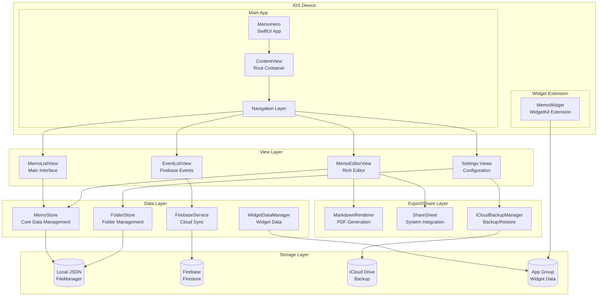
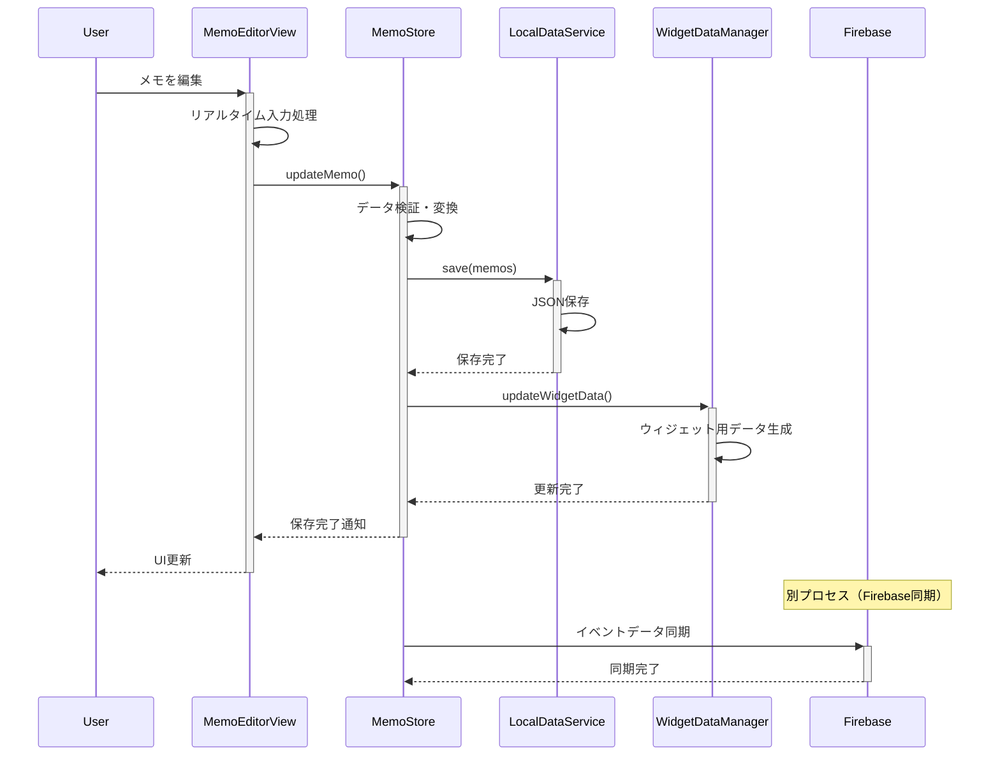
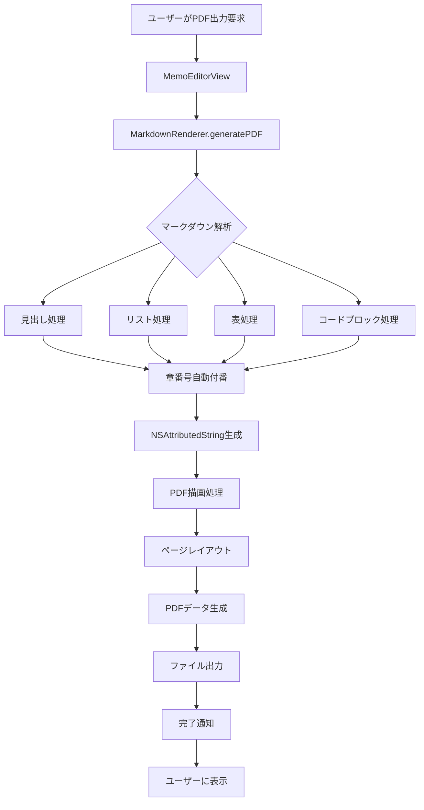

# MemoHero

**高機能マークダウンメモアプリケーション for iOS/iPadOS**

MemoHeroは、SwiftUIとUIKitのハイブリッド構成で開発された、iOS/iPadOS向けの多機能メモアプリケーションです。マークダウン記法完全対応、フォルダ管理、PDF出力、Firebase連携、ウィジェット対応など、プロフェッショナルな機能を提供します。

## 主要機能

### メモ管理機能
- **作成・編集・削除**: 直感的なメモ操作インターフェース
- **マークダウン完全対応**: 見出し、太字、斜体、リスト、表、コードブロック、引用文、取り消し線
- **リアルタイムプレビュー**: 編集モードとプレビューモードのシームレス切り替え
- **検索・置換機能**: 高速全文検索、正規表現対応、一括置換
- **自動保存**: リアルタイム保存、キャンセル時の状態復元
- **編集時間計測**: メモごとの詳細な編集時間記録（HH:MM:SS形式）
- **テンプレート機能**: 自己分析テンプレートによる効率的なメモ作成

### 組織・管理機能
- **フォルダ管理**: 階層的なカテゴリ分類、ドラッグ&ドロップ対応
- **ピン留め機能**: 重要メモの優先表示
- **複数選択操作**: 一括削除、フォルダ移動
- **期日管理**: 期日設定、通知機能、カレンダー表示
- **テンプレート機能**: 定型文書の効率的作成

### 表示・カスタマイズ
- **テーマシステム**: システム/ライト/ダークモード自動対応
- **マークダウン表示切り替え**: プレビューのON/OFF
- **文字数・単語数表示**: リアルタイムカウント
- **レスポンシブデザイン**: iPhone/iPad最適化UI

### エクスポート・共有
- **PDF出力**: 高品質PDFファイル生成（章番号自動付番）
- **マークダウン出力**: .mdファイル形式での保存
- **テキスト共有**: プレーンテキスト形式
- **印刷機能**: iOS標準印刷機能統合
- **システム共有**: ShareSheet連携

### クラウド・連携
- **Firebase統合**: リアルタイムデータ同期、イベント情報管理
- **CloudKitバックアップ**: 安全なiCloudバックアップ・履歴管理・個別復元
- **プッシュ通知**: FCM連携、カテゴリ別通知、通知履歴管理
- **イベント管理**: Firebase経由のイベント情報表示、自己分析テンプレート提供
- **ウィジェット対応**: ホーム画面ウィジェット（iOS 14+）、4サイズ対応、マークダウンレンダリング
- **プロフィール機能**: 包括的なユーザープロフィール管理（完全ローカル保存）

## 技術仕様

### システム要件
- **対応OS**: iOS 17.0以降
- **対応デバイス**: iPhone、iPad
- **言語**: 日本語
- **ストレージ**: 約15MB（アプリ本体）

### アーキテクチャ



### 使用技術スタック
- **フレームワーク**: SwiftUI 5.0, UIKit (Hybrid)
- **データ管理**: ObservableObject + Combine
- **永続化**: JSON + FileManager
- **クラウド**: Firebase Firestore
- **UI**: NavigationSplitView, Sheet, Alert
- **カスタムコンポーネント**: HighlightableTextEditor
- **外部連携**: UniformTypeIdentifiers, WidgetKit

## 主要画面構成

### メイン画面 (MemoListView)
- メモ一覧表示（並び替え：更新日時、作成日時、タイトル）
- 検索バー（全文検索対応）
- フォルダフィルタリング
- 複数選択モード
- 新規作成ボタン

### メモ編集画面 (MemoEditorView)
- リッチテキストエディタ（マークダウン対応）
- 編集/プレビューモード切り替え
- ツールバー（書式設定、エクスポート）
- 検索・置換機能
- 自動保存・手動保存

### プロフィール画面 (ProfileView) - 新機能
- **基本プロフィール**: 年齢、学年、居住地域、部活動、興味・関心分野
- **挑戦・スキル**: 挑戦経験、得意スキル、習得希望スキル
- **キャラクター性**: ヒーロータイプ診断、性格特性、モチベーション源
- **ビジョン・志向**: 将来の目標、ロールモデル、解決したい課題
- **挑戦ログ**: 現在の挑戦、最近の成長記録
- **リソース**: 利用可能機器、協力してくれる大人、所属コミュニティ
- **興味関心プリセットボタン**: 15種類の選択肢から簡単選択
- **プルダウンメニュー**: コンパクトなUI設計

### 設定画面
- テーマ選択（ライト/ダーク/システム）
- マークダウン表示設定
- フォルダ管理
- バックアップ・復元
- Firebase設定
- プロフィール管理

## データモデル

### Memo
```swift
struct Memo: Identifiable, Codable {
    let id: UUID                    // 一意識別子
    var title: String              // タイトル
    var content: String            // 本文（マークダウン）
    var createdAt: Date           // 作成日時
    var updatedAt: Date           // 更新日時
    var folderId: UUID?           // 所属フォルダID
    var isPinned: Bool            // ピン留めフラグ
    var dueDate: Date?            // 期日
    var totalEditingTime: TimeInterval // 編集時間
}
```

### Folder
```swift
struct Folder: Identifiable, Codable {
    let id: UUID           // 一意識別子
    var name: String       // フォルダ名
    let createdAt: Date    // 作成日時
    var updatedAt: Date    // 更新日時
}
```

### UserProfile - 新機能
```swift
struct UserProfile: Codable {
    // 基本プロフィール
    var age: Int?                           // 年齢
    var grade: String                       // 学年
    var location: String                    // 居住地域
    var club: String                        // 部活動
    var interests: [String]                 // 興味・関心分野
    
    // 挑戦・スキル
    var challengeExperiences: [String]      // 挑戦経験
    var strongSkills: [String]              // 得意スキル
    var improvementSkills: [String]         // 習得希望スキル
    
    // キャラクター性
    var heroType: HeroType?                 // ヒーロータイプ
    var personalityTraits: PersonalityTraits // 性格特性
    var motivationSources: [MotivationSource] // モチベーション源
    
    // ビジョン・志向
    var futureGoals: String                 // 将来の目標
    var roleModel: String                   // ロールモデル
    var problemsToSolve: String             // 解決したい課題
    
    // 挑戦ログ
    var currentChallenges: [String]         // 現在の挑戦
    var recentGrowth: [String]              // 最近の成長
    
    // リソース
    var equipment: [String]                 // 利用可能機器
    var supportingAdults: String            // 協力してくれる大人
    var communities: [String]               // 所属コミュニティ
}
```

## マークダウン記法サポート

### 基本記法
```markdown
# 見出し1
## 見出し2
### 見出し3

**太字**
*斜体*
~~取り消し線~~

- リスト項目1
- リスト項目2
  - インデントリスト

1. 番号付きリスト
2. 項目2

> 引用文

`インラインコード`

\```
コードブロック
\```

[リンク](https://example.com)

| 表 | 見出し |
|---|--------|
| セル1 | セル2 |
```

### 高度な機能
- **チェックボックス**: `- [ ] タスク`
- **数式**: LaTeX記法対応（一部）
- **章番号自動付番**: PDF出力時の自動番号付け
- **画像埋め込み**: インライン画像対応

## データフロー

### メモ作成・編集フロー


### PDF出力フロー


## カスタマイズ機能

### テーマシステム
- **ライトテーマ**: 白背景ベースの明るいUI
- **ダークテーマ**: 黒背景ベースの暗いUI
- **システム**: OSの設定に自動追従

### 表示オプション
- **マークダウンプレビュー**: ON/OFF切り替え
- **行番号表示**: エディタでの行番号
- **文字カウント**: 文字数/単語数/行数表示
- **編集時間**: リアルタイム編集時間計測

## データ管理

### ローカル保存
```
Documents/
├── memos.json          // メモデータ
├── folders.json        // フォルダデータ
├── settings.json       // アプリ設定
├── user_profile.json   // ユーザープロフィール
└── backups/           // ローカルバックアップファイル

CloudKit Container/
├── backup_records      // バックアップメタデータ
└── memo_backups       // 暗号化済みバックアップデータ

App Groups/
└── widget_memos.json   // ウィジェット用共有データ
```

### クラウド同期（Firebase）
- リアルタイム同期
- 競合解決機能
- オフライン対応
- セキュアな認証

### バックアップ・復元（CloudKit）
- **クイックバックアップ**: ワンタッチでのバックアップ実行
- **コメント付きバックアップ**: バックアップ内容に説明を付加
- **バックアップ履歴**: 最新10件の履歴管理・個別復元
- **緊急復元機能**: 完全なデータ損失からの復旧
- **自動クリーンアップ**: 古いバックアップの自動削除

## セキュリティ・プライバシー

### データ保護
- **ローカルファーストアーキテクチャ**: すべてのデータはデバイス内優先保存
- **プロフィール完全保護**: プロフィール情報は100%ローカル保存、開発元にも送信なし
- **エンドツーエンド暗号化**: Firebase通信とCloudKitバックアップ
- **サンドボックス環境**: iOS標準セキュリティによる隔離実行
- **個人情報非収集**: ユーザーを特定可能な情報は一切収集しません

### 入力制限
- メモサイズ: 最大1MB
- ファイル名: 特殊文字適切処理
- 文字エンコーディング: UTF-8完全対応

## パフォーマンス

### 最適化機能
- 非同期データ処理
- メモリ効率的な描画
- 遅延読み込み
- デバウンス処理

### レスポンス性能
- 起動時間: <2秒
- 検索応答: <0.5秒
- 保存処理: リアルタイム
- PDF生成: <5秒（1000行文書）

## 品質保証

### テスト環境
- iOS Simulator (17.0+)
- 実機テスト (iPhone/iPad)
- 自動化テスト
- パフォーマンステスト

### エラーハンドリング
```swift
enum MemoHeroError: Error, LocalizedError {
    case dataCorruption(String)
    case networkFailure(String)
    case exportFailure(String)
    case importFailure(String)
}
```

## 今後の開発予定

### 短期計画 v1.1
- [ ] Apple Watch対応
- [ ] Siri Shortcuts統合
- [ ] 音声入力機能
- [ ] より多くのマークダウン拡張

### 中長期計画 v2.0+
- [ ] macOS版アプリ
- [ ] コラボレーション機能
- [ ] プラグインシステム
- [ ] AI支援機能

## 参考資料

### ドキュメント
- [基本設計書.md](基本設計書.md) - アーキテクチャ詳細
- [詳細設計書.md](詳細設計書.md) - 実装仕様
- [ユーザー取扱説明書.md](ユーザー取扱説明書.md) - 操作マニュアル
- [プライバシーポリシー.md](プライバシーポリシー.md) - プライバシー保護方針

### 技術情報
- SwiftUI Documentation (Apple)
- Firebase iOS SDK Guide
- WidgetKit Framework Guide

## コントリビュート

### 開発環境
- Xcode 15.0+
- iOS 17.0+ SDK
- Swift 5.9+
- Firebase CLI

### プルリクエスト
1. Forkしてfeatureブランチ作成
2. 変更実装・テスト実施
3. プルリクエスト作成
4. レビュー・マージ

## ライセンス

**MIT License**

Copyright (c) 2024 kondokenji

Permission is hereby granted, free of charge, to any person obtaining a copy of this software and associated documentation files (the \"Software\"), to deal in the Software without restriction, including without limitation the rights to use, copy, modify, merge, publish, distribute, sublicense, and/or sell copies of the Software, and to permit persons to whom the Software is furnished to do so, subject to the following conditions:

The above copyright notice and this permission notice shall be included in all copies or substantial portions of the Software.

THE SOFTWARE IS PROVIDED \"AS IS\", WITHOUT WARRANTY OF ANY KIND, EXPRESS OR IMPLIED, INCLUDING BUT NOT LIMITED TO THE WARRANTIES OF MERCHANTABILITY, FITNESS FOR A PARTICULAR PURPOSE AND NONINFRINGEMENT. IN NO EVENT SHALL THE AUTHORS OR COPYRIGHT HOLDERS BE LIABLE FOR ANY CLAIM, DAMAGES OR OTHER LIABILITY, WHETHER IN AN ACTION OF CONTRACT, TORT OR OTHERWISE, ARISING FROM, OUT OF OR IN CONNECTION WITH THE SOFTWARE OR THE USE OR OTHER DEALINGS IN THE SOFTWARE.


**MemoHero v1.0** - プロフェッショナルなメモ体験を、あなたの手に。  
**主要機能**: プロフィール機能・FCMプッシュ通知・CloudKitバックアップ・カレンダー統合 | **対応**: iOS 17.0+ | **パフォーマンス**: 高速・軽量設計 | **プライバシー**: プロフィール情報100%ローカル保存・開発元送信なし