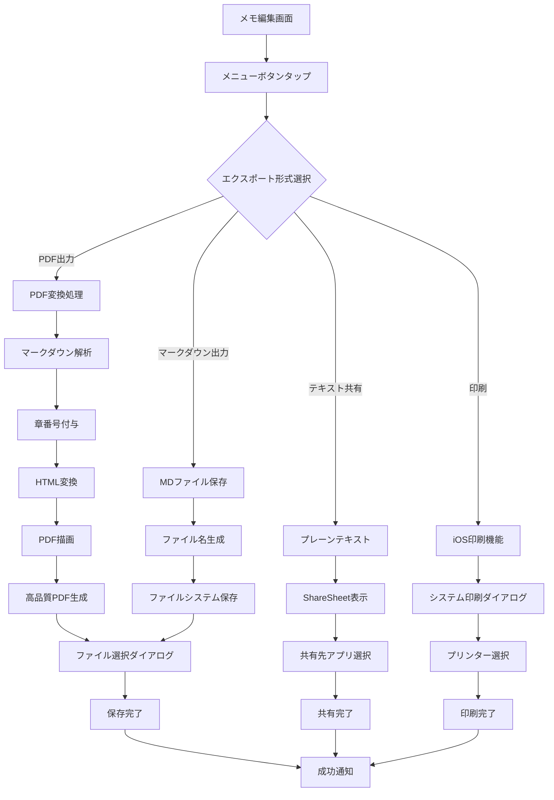
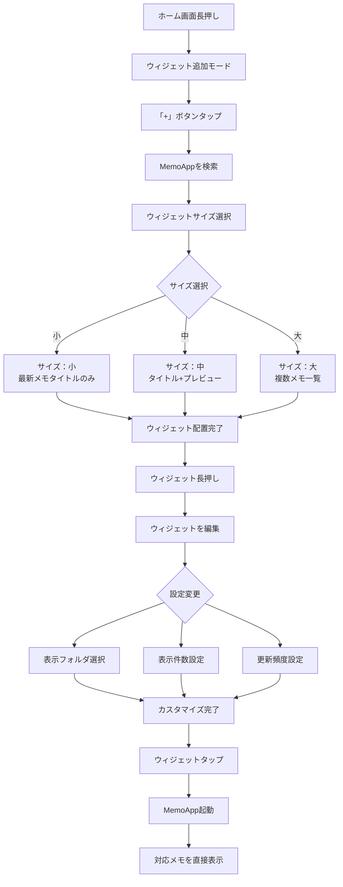
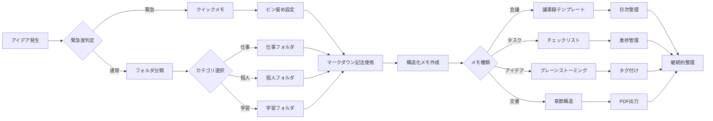

# MemoHero ユーザー取扱説明書

**Version 1.0 | 最終更新: 2025年8月29日**

## はじめに

### ようこそ MemoHero へ
MemoHeroは、マークダウン記法に対応したプロフェッショナルなメモアプリケーションです。美しい文書作成から高品質なPDF出力まで、あなたのアイデアを最適な形で記録・共有できます。

### このガイドについて
このユーザー取扱説明書では、MemoHeroの全機能を分かりやすく説明し、効率的な使い方をご案内します。初心者から上級者まで、すべてのユーザーに役立つ情報を提供します。

## 基本操作

### アプリの起動
1. ホーム画面からMemoHeroアイコンをタップ
2. 初回起動時は、デフォルトフォルダ（個人・仕事・アイデア）が自動作成されます
3. メモ一覧画面が表示され、すぐに利用開始できます

### 画面構成
```
┌─────────────────────────────────┐
│ 設定  MemoHero  イベント  通知  │ <- ヘッダー
├─────────────────────────────────┤
│ 検索バー                     │ <- 検索機能
├─────────────────────────────────┤
│ すべて ▼     カレンダー      │ <- フォルダ・表示切替
├─────────────────────────────────┤
│ 重要なメモ (ピン留め済み)      │ 
│ 会議議事録                    │
│ プロジェクト企画書             │ <- メモ一覧
│ アイデアメモ                  │
├─────────────────────────────────┤
│              ➕                 │ <- 新規作成ボタン
└─────────────────────────────────┘
```

## メモの作成と編集

### 新規メモの作成

#### 方法1: 基本的な作成
1. **➕ボタンをタップ** → 新しいメモが作成されます
2. **タイトルと内容を入力** → 自動的にタイトルが抽出されます
3. **完了ボタンをタップ** → メモが保存されます

#### 方法2: テンプレートから作成
1. **➕ボタンを長押し** → テンプレート選択画面が表示
2. **好みのテンプレートを選択** → 定型文が挿入されます
3. **内容をカスタマイズ** → 必要に応じて編集します

#### 方法3: クリップボードから作成
1. **事前に他のアプリでテキストをコピー**
2. **➕ボタンをタップ**
3. **「クリップボードから貼り付け」を選択**
4. **コピーした内容が自動挿入されます**

### メモの編集

#### 編集モードとプレビューモード
- **編集モード**: マークダウンテキストを直接編集
- **プレビューモード**: 美しくフォーマットされた表示

切り替え方法：
```
編集モード ←→ プレビューモード
   📝           👁️
```

#### 編集画面の使い方
1. **メモをタップ** → 編集画面が開きます
2. **セグメントコントロール** → 編集/プレビューを切り替え
3. **ツールバーメニュー（⋯）** → 各種機能にアクセス
4. **完了またはキャンセル** → 変更を保存/破棄

#### 保存のルール
- **完了ボタン**: 変更を保存して終了
- **戻るボタン**: 変更を保存して終了
- **スワイプダウン**: 変更を保存して終了
- **キャンセルボタン**: ⚠️ 変更を破棄して元の状態に復元

## マークダウン記法ガイド

### マークダウン要素構造

```mermaid
flowchart TB
    A[マークダウンテキスト] --> B{要素タイプ判定}
    
    B -->|#| C[見出し<br/>H1-H6]
    B -->|**| D[太字]
    B -->|*| E[斜体]
    B -->|-| F[箇条書きリスト]
    B -->|1.| G[番号付きリスト]
    B -->|```| H[コードブロック]
    B -->|>| I[引用文]
    B -->|\|..\|| J[テーブル]
    B -->|[](| K[リンク]
    
    C --> L[プレビュー表示]
    D --> L
    E --> L
    F --> M[インデント処理]
    G --> M
    H --> N[シンタックスハイライト]
    I --> O[左インデント表示]
    J --> P[グリッドレイアウト]
    K --> Q[ハイパーリンク]
    
    M --> L
    N --> L
    O --> L
    P --> L
    Q --> L
    
    L --> R[美しい表示]
```

### 基本的な書式設定

#### 見出し
```markdown
# 大見出し (H1)
## 中見出し (H2) 
### 小見出し (H3)
#### 詳細見出し (H4)
##### 補足見出し (H5)
###### 注記見出し (H6)
```

#### 文字装飾
```markdown
**太字（ボールド）**
*斜体（イタリック）*
~~取り消し線~~
`インラインコード`
```

#### リスト
```markdown
// 箇条書きリスト
- 項目1
- 項目2
  - サブ項目2-1
  - サブ項目2-2
- 項目3

// 番号付きリスト  
1. 第一項目
2. 第二項目
   1. サブ項目2-1
   2. サブ項目2-2
3. 第三項目
```

#### チェックリスト
```markdown
- [ ] 未完了のタスク
- [x] 完了済みのタスク
- [ ] 進行中のタスク
```

### 高度な機能

#### 引用文
```markdown
> これは引用文です。
> 複数行にわたって
> 引用することができます。
```

#### コードブロック
```markdown
\```javascript
function helloWorld() {
    console.log(\"Hello, World!\");
}
\```

\```python
def hello_world():
    print(\"Hello, World!\")
\```
```

#### 表（テーブル）
```markdown
| 名前 | 年齢 | 職業 |
|------|------|------|
| 田中 | 30 | エンジニア |
| 佐藤 | 25 | デザイナー |
| 鈴木 | 35 | マネージャー |
```

#### リンク
```markdown
[Google](https://www.google.com)
[MemoAppについて](https://example.com/memoapp)
```

### PDF出力時の特別機能

#### 章番号の自動付番
マークダウンの見出し（H2以降）に自動で番号が付きます：
```
## 概要          → 1. 概要
### 背景         → 1.1. 背景  
### 目的         → 1.2. 目的
## 詳細設計      → 2. 詳細設計
### 要件         → 2.1. 要件
```

## フォルダ管理

### フォルダの基本操作

#### デフォルトフォルダ
- **個人**: プライベートなメモ
- **仕事**: 業務関連のメモ  
- **アイデア**: 創造的なメモ

#### 新しいフォルダの作成
1. **⚙️設定ボタンをタップ**
2. **「フォルダ管理」を選択**
3. **「新規フォルダ」をタップ**
4. **フォルダ名を入力して保存**

#### フォルダの編集・削除
1. **フォルダ管理画面でフォルダを選択**
2. **編集**: フォルダ名を変更
3. **削除**: フォルダを削除（中のメモは「すべて」に移動）

### メモのフォルダ移動

#### 方法1: 編集画面から
1. **メモを開く**
2. **ツールバーメニュー（⋯）をタップ**
3. **「フォルダ移動」を選択**
4. **移動先フォルダを選択**

#### 方法2: 一覧画面から
1. **メモを長押し**
2. **「フォルダ移動」を選択**
3. **移動先フォルダを選択**

## 検索・置換機能

### 基本検索
1. **🔍検索バーをタップ**
2. **検索キーワードを入力**
3. **該当するメモが自動的にフィルタされます**

### 高度な検索・置換

#### 検索機能の使い方
1. **メモ編集画面で🔍アイコンをタップ**
2. **検索モードが開始されます**
3. **検索結果が黄色でハイライト表示**
4. **⬆️⬇️ボタンで検索結果を移動**

#### 置換機能の使い方
1. **検索モードで「置換」をタップ**
2. **「検索」と「置換」フィールドに入力**
3. **「次を置換」**: 1つずつ置換
4. **「全て置換」**: 一括置換

#### 検索オプション
- **大文字小文字を区別**: オン/オフ切り替え可能
- **正規表現**: 高度なパターンマッチング対応
- **単語全体**: 完全一致検索

## エクスポート・共有機能

### エクスポートフロー



### エクスポート形式

#### PDF出力
**特徴**:
- 高品質な文書形式
- 章番号自動付番
- プロフェッショナルなレイアウト
- 印刷に最適化

**手順**:
1. メモ編集画面で**メニューをタップ**
2. **「PDF出力」を選択**
3. **ファイル名と保存場所を指定**
4. **完了通知が表示されます**

#### マークダウン出力
**特徴**:
- 元のマークダウン形式を保持
- 他のエディタで編集可能
- 軽量なテキストファイル

**手順**:
1. メモ編集画面で**メニューをタップ**
2. **「マークダウン出力」を選択**
3. **保存場所を選択**

#### テキスト共有
**特徴**:
- プレーンテキスト形式
- SNSやメールで直接共有
- 軽量で汎用的

**手順**:
1. メモ編集画面で**メニューをタップ**
2. **「共有」を選択**
3. **共有先アプリを選択**

### システム共有機能
iOS標準のShareSheetを使用して、以下へ直接共有できます：
- **メール**: 添付ファイルまたは本文
- **メッセージ**: テキストまたは添付
- **AirDrop**: 近くのデバイスへ転送
- **クラウドストレージ**: iCloud Drive、Dropbox等
- **SNS**: Twitter、Facebook等

## プロフィール機能

### プロフィール管理システム

MemoHeroでは、イベント分析テンプレート生成やメモ作成支援のための詳細なプロフィール機能を提供しています。

#### プロフィール項目
1. **基本プロフィール**
   - 年齢、学年、居住地域（都道府県レベル）
   - 部活動・クラブ活動、興味・関心分野

2. **チャレンジ・スキル**
   - 過去の経験、得意なスキル、伸ばしたいスキル

3. **キャラクター分析**
   - ヒーロータイプ（リーダー、アイデア、サポート、専門、探索）
   - 性格特性、やる気の源泉

4. **ビジョン・目標**
   - 将来の目標、ロールモデル、解決したい問題

5. **チャレンジログ**
   - 現在のチャレンジ、最近の成長

6. **リソース**
   - 利用可能な機器、支援者、コミュニティ情報

### プロフィール設定手順
1. **設定をタップ**
2. **「プロフィール」を選択**
3. **各セクションを順番に入力**
4. **「保存」で設定完了**

**プライバシー保護について**:
- **100%ローカル保存**: プロフィール情報はユーザーのデバイス内にのみ保存
- **外部送信なし**: 開発元や第三者に情報が送信されることは一切ありません
- **暗号化保護**: iOS標準暗号化により他のアプリからアクセス不可
- **任意入力**: すべての項目は空白でも利用可能
- **即座削除**: いつでも個別または一括削除が可能

## 通知機能

### プッシュ通知システム

#### 通知カテゴリ
- **期日通知**: メモの期日前アラート
- **新しいイベント**: Firebase連携による最新イベント情報
- **更新通知**: アプリやイベントの更新情報  
- **リマインダー**: カスタム設定によるリマインダー
- **期日アラート**: 期限間近のメモ通知

#### 通知設定
1. **設定をタップ**
2. **「プッシュ通知設定」を選択**
3. **各カテゴリのオン/オフを設定**
4. **「通知履歴を見る」で履歴確認**

#### 通知履歴管理
- **自動記録**: 受信したすべての通知を自動保存
- **詳細表示**: タップして関連メモやイベントを確認
- **履歴クリア**: 不要な履歴の一括削除機能

## 設定とカスタマイズ

### 設定項目構造

```mermaid
flowchart TB
    A[設定メイン] --> B[プロフィール]
    A --> C[テーマ設定]
    A --> D[表示設定]
    A --> E[通知設定]
    A --> F[フォルダ管理]
    A --> G[バックアップ・復元]
    
    B --> H[基本プロフィール]
    B --> I[チャレンジ・スキル]
    B --> J[キャラクター分析]
    B --> K[ビジョン・目標]
    
    C --> L[システム連動]
    C --> M[ライトモード]
    C --> N[ダークモード]
    
    D --> O[マークダウンプレビュー]
    D --> P[フォントサイズ]
    D --> Q[行間設定]
    
    E --> R[期日通知]
    E --> S[イベント通知]
    E --> T[バックアップ通知]
    E --> U[通知履歴管理]
    
    F --> V[新規フォルダ作成]
    F --> W[フォルダ名変更]
    F --> X[フォルダ削除]
    
    G --> Y[クイックバックアップ]
    G --> Z[コメント付きバックアップ]
    G --> AA[バックアップ履歴]
    G --> BB[個別復元]
```



### アプリ設定

#### テーマ設定
1. **設定をタップ**
2. **「テーマ」を選択**
3. **好みのテーマを選択**:
   - **システム**: iOS設定に自動追従
   - **ライト**: 明るいテーマ
   - **ダーク**: 暗いテーマ

#### 表示設定
- **マークダウンプレビュー**: デフォルトの表示モード
- **フォントサイズ**: 読みやすいサイズに調整
- **行間設定**: テキストの密度を調整

### 通知設定

#### 期日通知
1. **メモに期日を設定**
2. **事前通知を有効化**
3. **通知時間を設定**（1分〜1週間前）
4. **指定した時間に自動通知**

#### プッシュ通知
- **新しいイベント**: Firebase連携イベントの通知
- **バックアップ完了**: 自動バックアップの状況通知

## クラウド機能

### Firebaseイベント同期フロー

```mermaid
sequenceDiagram
    participant U as ユーザー
    participant A as MemoApp
    participant F as Firebase
    participant S as Firestore
    
    U->>+A: イベントボタンタップ
    A->>+F: Firebase接続確認
    F-->>-A: 接続状態通知
    
    alt 接続成功
        A->>+S: イベントデータ要求
        S-->>-A: イベントリスト返却
        A->>A: データ解析・ソート
        A-->>-U: イベント一覧表示
        
        U->>+A: イベント選択
        A->>A: マークダウンレンダリング
        A-->>-U: イベント詳細表示
    else 接続失敗
        A-->>-U: エラーメッセージ表示
        
        Note over U,S: オフラインモードで継続使用可能
    end
```

### Firebase連携イベント

#### イベント一覧の確認
1. **イベントボタンをタップ**
2. **最新のイベント情報が表示**
3. **イベントをタップして詳細を確認**

#### イベント詳細画面
- **タイトル**: イベントの名称
- **内容**: 詳細な説明（マークダウン対応）
- **日時**: 開催予定日時
- **カテゴリ**: イベントの分類

### iCloudバックアップ（CloudKit連携）

#### バックアップ機能の特徴
- **CloudKit統合**: Apple標準技術による安全なクラウド保存
- **バックアップ履歴**: 最新10件の自動管理
- **個別復元**: 任意のバックアップから選択復元
- **コメント機能**: 各バックアップにメモ追加可能

#### クイックバックアップ
1. **設定をタップ**
2. **「バックアップ・復元」を選択**
3. **「クイックバックアップ」をタップ**
4. **自動でバックアップ実行・完了通知**

#### コメント付きバックアップ
1. **設定 → バックアップ・復元**
2. **「コメント付きバックアップ」を選択**
3. **バックアップ内容のコメントを入力**
4. **「実行」でバックアップ開始**

#### バックアップ履歴管理
1. **設定 → バックアップ・復元**
2. **「バックアップ履歴」をタップ**
3. **履歴一覧から操作選択**:
   - **復元**: 特定のバックアップから復元
   - **削除**: 不要なバックアップを削除
   - **詳細**: バックアップ内容の確認

#### 緊急復元機能
**完全なデータ損失時の復旧手順**:
1. **設定 → バックアップ・復元**
2. **「緊急復元」を選択**
3. **最新バックアップを確認**
4. **「完全復元」で全データ復旧**

## ウィジェット機能

### ウィジェット設定フロー



### ウィジェットの設定

#### ホーム画面への追加
1. **ホーム画面を長押し**
2. **左上の「+」をタップ**
3. **「MemoHero」を検索して選択**
4. **ウィジェットサイズを選択**:
   - **小**: 最新メモのタイトルのみ
   - **中**: 最新メモの内容プレビュー
   - **大**: 複数メモの一覧表示
   - **特大**: 詳細な内容とマークダウンレンダリング

#### ウィジェットのカスタマイズ
1. **ウィジェットを長押し**
2. **「ウィジェットを編集」をタップ**
3. **表示設定を調整**:
   - **表示するフォルダ**
   - **表示件数**
   - **更新頻度**

### ウィジェットから直接操作
- **タップ**: 該当メモを直接開く
- **マークダウンレンダリング**: 見出し、リスト、コードブロック対応
- **チェックリスト表示**: タスクの進捗を視覚的に確認
- **自動更新**: 15分間隔で最新情報を表示
- **App Group連携**: リアルタイムデータ同期

## 活用テクニック

### 効率的なメモ管理ワークフロー



### 効率的なメモ術

#### フォルダ戦略
```
仕事
  ├── 会議議事録
  ├── プロジェクト関連
  └── 日報・週報

学習
  ├── 技術メモ
  ├── 読書ノート
  └── アイデア

個人
  ├── 日記
  ├── 目標・計画
  └── 雑記
```

#### タグシステム
ハッシュタグを使った分類システム：
```markdown
# 会議議事録 #重要 #2024年8月

## 議題
#プロジェクトA #スケジュール #予算

## アクションアイテム  
- [ ] 資料作成 #田中 #8/30締切
- [ ] 顧客連絡 #佐藤 #8/28
```

#### テンプレート活用
よく使う形式をテンプレート化：
```markdown
# 会議議事録テンプレート

**日時**: YYYY/MM/DD HH:MM
**参加者**: 
**場所**: 

## 議題
1. 

## 決定事項
- 

## アクションアイテム
- [ ] 

## 次回予定
**日時**: 
**議題**: 
```

### マークダウン活用術

#### 階層的な文書構造
```markdown
# プロジェクト企画書

## 1. 概要
### 1.1. 背景
### 1.2. 目的

## 2. 要件定義
### 2.1. 機能要件
### 2.2. 非機能要件

## 3. スケジュール
### 3.1. フェーズ1
### 3.2. フェーズ2
```

#### 表を使ったデータ整理
```markdown
| タスク | 担当者 | 期限 | ステータス |
|--------|--------|------|-----------|
| 設計書作成 | 田中 | 8/30 | 進行中 |
| システム開発 | 佐藤 | 9/15 | 未着手 |
| テスト | 鈴木 | 9/30 | 未着手 |
```

#### チェックリストでタスク管理
```markdown
## 今日のタスク
- [x] メール確認
- [x] 会議準備
- [ ] 資料作成
- [ ] 顧客連絡
- [ ] 週報作成

## 今週の目標
- [ ] プロジェクトA完了
- [ ] 新規案件検討
- [ ] チーム研修企画
```

## トラブルシューティング

### よくある問題と解決方法

#### アプリが起動しない
**原因**: メモリ不足、データ破損
**解決方法**:
1. **デバイスを再起動**
2. **他のアプリを終了してメモリを確保**
3. **iOS版が最新か確認**
4. **アプリを再インストール**（データは保持されます）

#### メモが保存されない  
**原因**: ストレージ容量不足、権限問題
**解決方法**:
1. **デバイスのストレージ容量を確認**
2. **不要なファイルを削除**
3. **アプリの権限設定を確認**
4. **手動保存を試行**（完了ボタンをタップ）

#### 検索結果が表示されない
**原因**: インデックス更新遅延、特殊文字
**解決方法**:
1. **アプリを一度終了して再起動**
2. **検索キーワードを変更**
3. **大文字小文字の設定を確認**
4. **特殊文字を削除**

#### PDF出力が失敗する
**原因**: メモリ不足、文書サイズ過大
**解決方法**:
1. **他のアプリを終了**
2. **メモを分割して出力**
3. **画像数を削減**
4. **デバイス再起動後に再試行**

#### 同期が失敗する
**原因**: ネットワーク接続、Firebase設定
**解決方法**:
1. **ネットワーク接続を確認**
2. **Wi-Fiまたはモバイルデータを切り替え**
3. **アプリを再起動**
4. **設定でFirebase接続を確認**

### エラーメッセージ一覧

| エラーメッセージ | 原因 | 解決方法 |
|-----------------|------|----------|
| \"ファイルへのアクセスが拒否されました\" | 権限不足 | 設定→プライバシー→ファイルとフォルダでアクセス許可 |
| \"ディスク容量が不足しています\" | ストレージ不足 | 不要なファイルを削除してストレージを確保 |
| \"データが破損しています\" | ファイル破損 | バックアップから復元または初期化 |
| \"ネットワークに接続できません\" | 接続問題 | Wi-Fi/モバイルデータ設定を確認 |

### バックアップからの復元

#### 緊急時の完全復元
1. **設定→バックアップ・復元**
2. **「緊急復元」を選択**
3. **最新の自動バックアップを確認**
4. **「完全復元」をタップ**
5. **確認画面で「実行」をタップ**

**注意**: 復元により現在のデータは上書きされます

## サポート情報

### お問い合わせ先
- **アプリ内**: 設定→ヘルプ・サポート
- **メール**: support@memohero.com
- **FAQ**: https://memohero.com/faq

### 要望・フィードバック
- **機能要望**: 設定→フィードバック送信
- **バグレポート**: 設定→バグ報告
- **評価・レビュー**: App Store

### システム要件
- **対応OS**: iOS 17.0 以降
- **対応デバイス**: iPhone、iPad
- **ストレージ**: 50MB以上の空き容量推奨
- **ネットワーク**: Firebase機能利用時のみ必要

### プライバシー・セキュリティ
- **データ収集**: 個人情報は一切収集しません
- **ローカル保存**: すべてのデータは端末内に安全に保存
- **プロフィール保護**: プロフィール情報は100%ローカル保存、開発元にも送信されません
- **暗号化**: iOS標準の暗号化技術を使用
- **外部送信**: ユーザーの明示的な操作時のみ（共有機能使用時）

## カレンダー機能

### 統合カレンダー表示

#### カレンダーモード
1. **カレンダーボタンをタップ**
2. **月表示でメモ関連日付を確認**
3. **日付をタップして該当メモを表示**

#### カレンダー指標システム
- **青い点**: メモ作成日
- **緑の点**: メモ更新日  
- **赤い点**: メモ期日
- **複数色**: 複数のイベントがある日

#### カレンダー操作
- **月切り替え**: 左右スワイプまたは矢印ボタン
- **日付選択**: タップで該当日のメモ一覧表示
- **今日に戻る**: 「今日」ボタンで現在日にジャンプ

## 主要機能

### コア機能
- **プロフィール管理**: 包括的なユーザープロフィールシステム（完全ローカル保存）
- **プッシュ通知**: FCM連携による高度な通知機能
- **通知履歴**: 受信通知の完全な履歴管理
- **CloudKit バックアップ**: 高度なiCloudバックアップシステム
- **カレンダー統合**: 視覚的な日付管理とイベント追跡
- **ウィジェット強化**: 特大サイズとマークダウンレンダリング
- **イベントテンプレート**: プロフィール連携分析テンプレート自動生成


## まとめ

MemoHeroは、あなたの創造性と生産性を最大限に引き出すために設計された、パワフルでありながら使いやすいメモアプリケーションです。

### 活用のポイント
1. **日常的な利用**: シンプルなメモから始める
2. **マークダウン習得**: 少しずつ記法を覚える  
3. **フォルダ整理**: 自分なりの分類システム構築
4. **バックアップ**: 定期的なデータ保護
5. **新機能活用**: アップデートで追加される機能を試す

### サポートについて
ご不明な点やご要望がございましたら、いつでもお気軽にお問い合わせください。私たちはMemoHeroを通じて、あなたの日々の記録と創作活動をサポートし続けます。

**MemoHero v1.0** - あなたのアイデアを、いつでも、どこでも、美しく記録。


## 改訂履歴

| Version | 日付 | 変更内容 | 担当者 |
|---------|------|----------|--------|
| 1.0 | 2025-08-29 | 初版作成 | kondokenji |

**MemoHero ユーザー取扱説明書 v1.0**  
© 2025 kondokenji. All rights reserved.