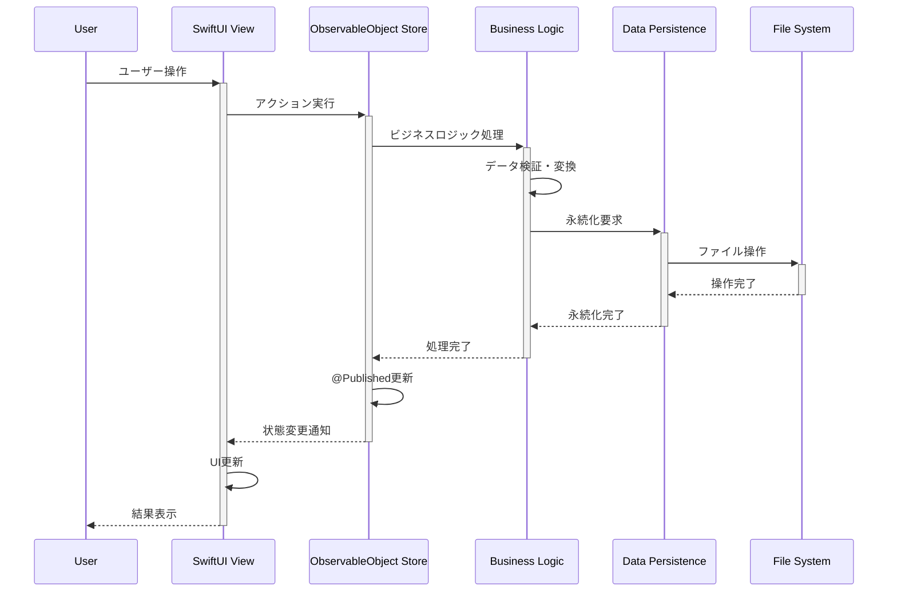
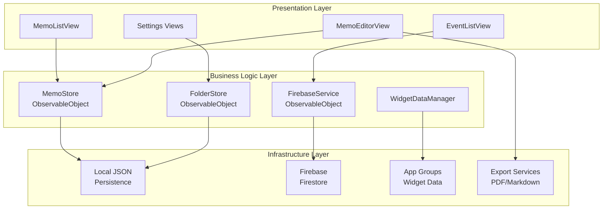
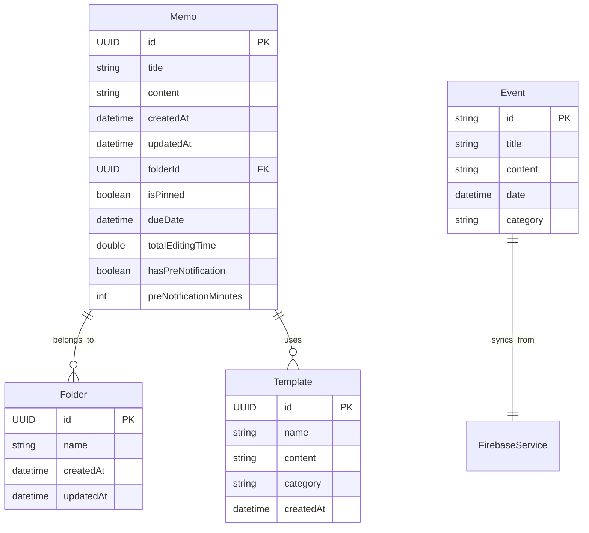
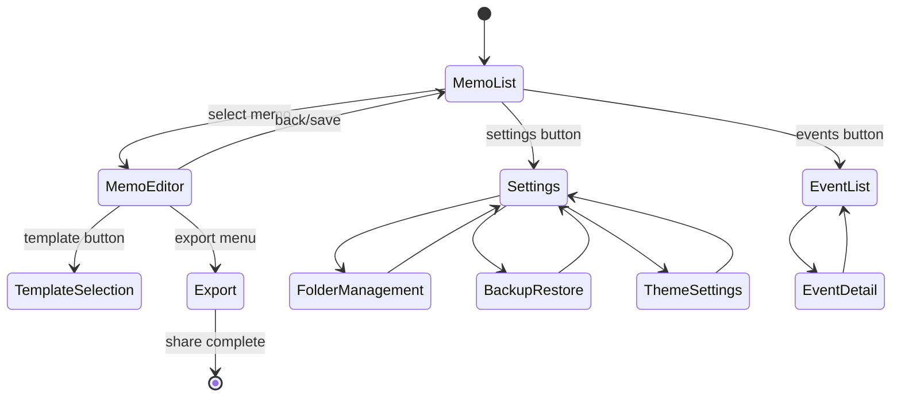
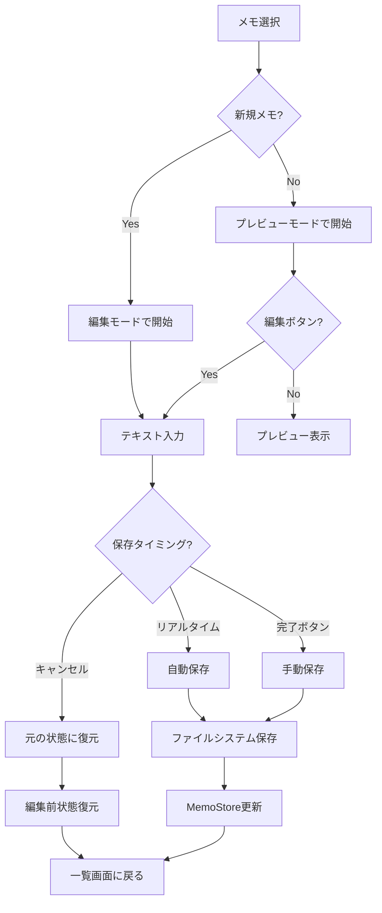
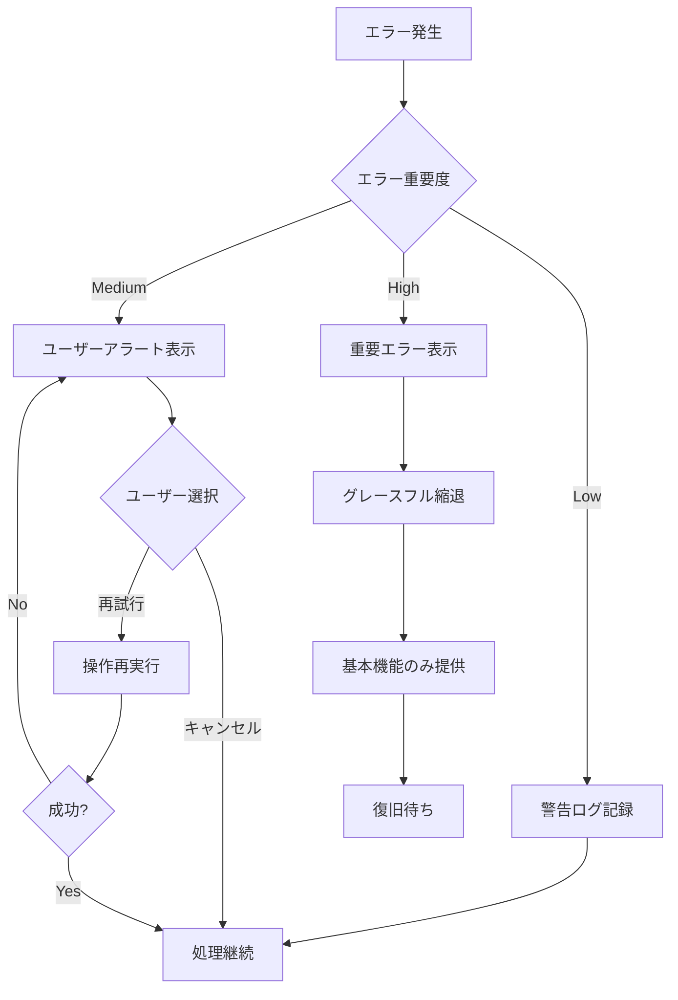
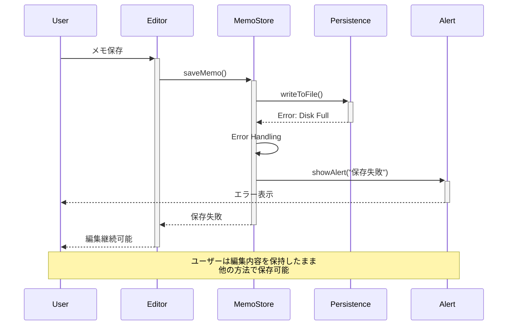
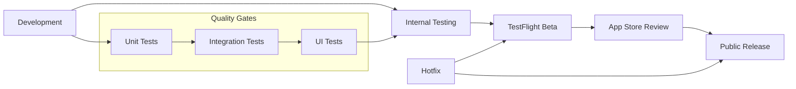
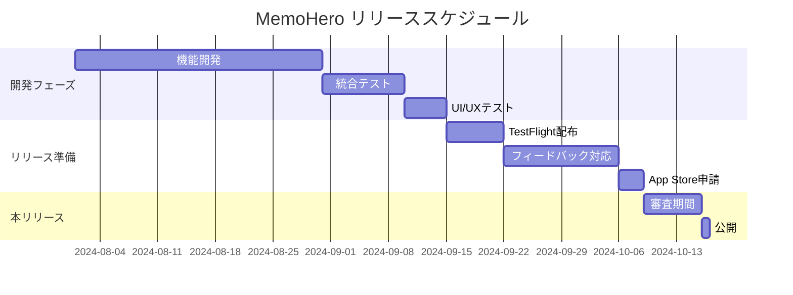

# MemoHero 基本設計書

**Version 1.0 | 最終更新: 2025年8月29日**

## 概要

### プロジェクト概要
MemoHeroは、SwiftUIとUIKitのハイブリッド構成で開発されたiOS/iPadOS向けの高機能マークダウンメモアプリケーションです。プロフェッショナルなメモ作成・管理機能を提供し、個人から企業まで幅広いユーザーのニーズに対応します。

### 設計目標
- **ユーザビリティ**: 直感的で使いやすいインターフェース
- **パフォーマンス**: 高速で軽量な動作
- **拡張性**: 将来の機能追加に対応できる柔軟な設計
- **保守性**: 理解しやすく変更しやすいコード構造
- **品質**: 堅牢でバグの少ない信頼性の高いアプリ

### 対象ユーザー
- **個人ユーザー**: 日常的なメモ作成・管理
- **学生**: 授業ノート・レポート作成
- **ビジネスユーザー**: 会議議事録・企画書作成
- **開発者**: 技術ドキュメント・仕様書作成
- **研究者**: 論文・研究ノート作成

## システムアーキテクチャ

### 全体構成図
```
┌─────────────────────────────────────────────────────────┐
│                    MemoHero                            │
├─────────────────────────────────────────────────────────┤
│  Presentation Layer (SwiftUI)                         │
│  ┌─────────────┬─────────────┬─────────────────────────┐ │
│  │ MemoListView│ MemoEditor  │ Settings & Other Views │ │
│  │             │ View        │                       │ │
│  └─────────────┴─────────────┴─────────────────────────┘ │
├─────────────────────────────────────────────────────────┤
│  Business Logic Layer                                  │
│  ┌─────────────┬─────────────┬─────────────────────────┐ │
│  │ MemoStore   │ FolderStore │ TemplateManager        │ │
│  │             │             │ NotificationManager    │ │
│  └─────────────┴─────────────┴─────────────────────────┘ │
├─────────────────────────────────────────────────────────┤
│  Infrastructure Layer                                  │
│  ┌─────────────┬─────────────┬─────────────────────────┐ │
│  │ Local       │ Firebase    │ Export/Import          │ │
│  │ Storage     │ Service     │ Services               │ │
│  └─────────────┴─────────────┴─────────────────────────┘ │
└─────────────────────────────────────────────────────────┘
```

### レイヤー構成

#### Presentation Layer (表示層)
- **責任**: UI表示、ユーザー操作の受付、画面遷移制御
- **技術**: SwiftUI, UIKit (カスタムコンポーネント)
- **主要コンポーネント**:
  - `MemoListView`: メインリスト画面
  - `MemoEditorView`: メモ編集画面
  - `EventListView`: Firebase連携イベント画面
  - 各種設定画面

#### Business Logic Layer (ビジネスロジック層)
- **責任**: アプリケーションロジック、データ変換、ビジネスルール実装
- **技術**: ObservableObject, Combine
- **主要コンポーネント**:
  - `MemoStore`: メモデータ管理
  - `FolderStore`: フォルダ管理
  - `FirebaseService`: クラウド同期
  - `WidgetDataManager`: ウィジェット連携

#### Infrastructure Layer (インフラ層)
- **責任**: データ永続化、外部サービス連携、システムリソースアクセス
- **技術**: FileManager, Firebase SDK, CloudKit
- **主要コンポーネント**:
  - JSON永続化システム
  - Firebase Firestore連携
  - iCloudバックアップ
  - エクスポート・インポート機能

### データフロー



## データモデル設計

### システムアーキテクチャ図



### エンティティ関係図



### データモデル詳細

#### Memo Model
```swift
struct Memo: Identifiable, Codable, Equatable {
    // MARK: - Core Properties
    let id: UUID                    // 一意識別子
    var title: String              // メモタイトル
    var content: String            // マークダウン本文
    var createdAt: Date           // 作成日時
    var updatedAt: Date           // 最終更新日時
    
    // MARK: - Organization Properties
    var folderId: UUID?           // 所属フォルダID
    var isPinned: Bool            // ピン留めフラグ
    
    // MARK: - Schedule Properties  
    var dueDate: Date?            // 期日
    var hasPreNotification: Bool  // 事前通知有無
    var preNotificationMinutes: Int // 事前通知時間(分)
    
    // MARK: - Analytics Properties
    var totalEditingTime: TimeInterval // 累計編集時間
    
    // MARK: - Computed Properties
    var displayTitle: String {
        title.isEmpty ? "無題のメモ" : title
    }
    
    var wordCount: Int {
        content.components(separatedBy: .whitespacesAndNewlines)
               .filter { !$0.isEmpty }.count
    }
    
    var characterCount: Int {
        content.count
    }
    
    var lineCount: Int {
        content.components(separatedBy: .newlines).count
    }
}
```

#### Folder Model
```swift
struct Folder: Identifiable, Codable, Hashable, Equatable {
    let id: UUID               // 一意識別子
    var name: String          // フォルダ名
    let createdAt: Date       // 作成日時
    var updatedAt: Date       // 最終更新日時
    
    // MARK: - Predefined Folders
    static let defaultFolders = [
        Folder(name: "個人", id: UUID()),
        Folder(name: "仕事", id: UUID()),
        Folder(name: "アイデア", id: UUID())
    ]
}
```

### 状態管理

#### State Management Pattern
```swift
// MARK: - Observable Store Pattern
class MemoStore: ObservableObject {
    @Published var memos: [Memo] = []
    @Published var isLoading: Bool = false
    @Published var error: MemoStoreError? = nil
    
    // MARK: - CRUD Operations
    func createMemo(_ memo: Memo)
    func updateMemo(_ memo: Memo) 
    func deleteMemo(_ memo: Memo)
    func fetchMemos()
    
    // MARK: - Query Operations
    func searchMemos(query: String) -> [Memo]
    func getMemosByFolder(_ folderId: UUID) -> [Memo]
    func getPinnedMemos() -> [Memo]
}
```

## システム設計

### モジュール構成

```
MemoHero/
├── App/
│   ├── MemoHeroApp.swift          // アプリエントリーポイント
│   └── ContentView.swift          // ルートビューコンテナ
├── Models/
│   ├── Memo.swift                 // メモデータモデル
│   ├── Folder.swift               // フォルダデータモデル
│   ├── Template.swift             // テンプレートモデル
│   ├── ProfileModel.swift         // プロフィールデータモデル
│   ├── FirebaseModels.swift       // Firebase連携モデル
│   └── NotificationModels.swift   // 通知関連モデル
├── Stores/
│   ├── MemoStore.swift            // メモデータ管理
│   ├── FolderStore.swift          // フォルダ管理
│   ├── TemplateManager.swift      // テンプレート管理
│   ├── NotificationManager.swift  // 通知管理
│   └── NotificationHistoryManager.swift // 通知履歴管理
├── Views/
│   ├── MemoListView.swift         // メインリスト画面
│   ├── MemoEditorView.swift       // メモ編集画面
│   ├── EventListView.swift        // イベント一覧画面
│   ├── ProfileView.swift          // プロフィール管理画面
│   ├── TemplateSelectionView.swift // テンプレート選択
│   ├── PushNotificationSettingsView.swift // 通知設定
│   ├── BackupHistoryView.swift    // バックアップ履歴
│   ├── iCloudBackupViews.swift    // CloudKitバックアップ
│   └── Settings/                  // 設定画面群
├── Components/
│   ├── HighlightableTextEditor.swift // カスタムエディタ
│   ├── MarkdownRenderer.swift     // PDF生成エンジン
│   └── CalendarWithIndicators.swift // カレンダーコンポーネント
├── Services/
│   ├── FirebaseService.swift      // Firebase連携
│   ├── WidgetDataManager.swift    // ウィジェット連携
│   ├── iCloudBackupManager.swift  // CloudKitバックアップ
│   ├── NotificationHistoryManager.swift // 通知履歴管理
│   └── ShareSheet.swift           // システム共有
├── Extensions/
│   ├── MemoEditorViewExtension.swift
│   └── MemoListViewCalendarExtension.swift
└── Resources/
    ├── Assets.xcassets            // アセット
    ├── Localizable.strings        // 多言語対応
    └── templates.csv              // テンプレートデータ
```

### 依存関係設計

#### Dependency Injection
```swift
// MARK: - Environment Objects Pattern
struct ContentView: View {
    @StateObject private var memoStore = MemoStore()
    @StateObject private var folderStore = FolderStore()
    @StateObject private var firebaseService = FirebaseService.shared
    
    var body: some View {
        MemoListView()
            .environmentObject(memoStore)
            .environmentObject(folderStore)
            .environmentObject(firebaseService)
    }
}
```

#### Service Layer
```swift
protocol DataPersistenceProtocol {
    func save<T: Codable>(_ data: T, to file: String) throws
    func load<T: Codable>(_ type: T.Type, from file: String) throws -> T
}

class LocalDataService: DataPersistenceProtocol {
    // JSON based local persistence implementation
}

class FirebaseDataService: DataPersistenceProtocol {
    // Firebase Firestore implementation
}
```

## インターフェース設計

### 画面構成

#### 画面遷移図


#### メモ編集フロー


#### ナビゲーション設計

```swift
// MARK: - Navigation Structure
enum NavigationDestination: Hashable {
    case memoEditor(Memo?)
    case settings
    case folderManagement
    case templateSelection
    case eventList
    case eventDetail(Event)
}

// MARK: - Navigation State Management
@MainActor
class NavigationCoordinator: ObservableObject {
    @Published var path = NavigationPath()
    @Published var presentedSheet: NavigationDestination?
    @Published var presentedFullScreen: NavigationDestination?
}
```

### UI/UX設計原則

#### デザインシステム

**カラーシステム**
```swift
enum AppColors {
    static let primary = Color.blue
    static let secondary = Color.gray
    static let accent = Color.orange
    static let background = Color(.systemBackground)
    static let surface = Color(.secondarySystemBackground)
    static let text = Color.primary
    static let textSecondary = Color.secondary
}
```

**タイポグラフィシステム**
```swift
enum AppFonts {
    static let largeTitle = Font.largeTitle.weight(.bold)
    static let title1 = Font.title.weight(.semibold)
    static let title2 = Font.title2.weight(.medium)
    static let body = Font.body
    static let caption = Font.caption
}
```

**レイアウトシステム**
```swift
enum AppLayout {
    static let paddingSmall: CGFloat = 8
    static let paddingMedium: CGFloat = 16
    static let paddingLarge: CGFloat = 24
    static let cornerRadius: CGFloat = 12
    static let shadowRadius: CGFloat = 4
}
```

#### レスポンシブデザイン

```swift
// MARK: - Adaptive Layout
struct AdaptiveLayout {
    static func isCompact(_ geometry: GeometryProxy) -> Bool {
        geometry.size.width < 768
    }
    
    static func columnCount(for width: CGFloat) -> Int {
        width < 768 ? 1 : (width < 1024 ? 2 : 3)
    }
}
```

## セキュリティ設計

### データ保護

#### ローカルストレージセキュリティ
- **サンドボックス**: iOS標準のアプリサンドボックス環境
- **暗号化**: 端末のハードウェア暗号化に依存
- **アクセス制御**: ファイルシステムレベルでのアクセス制限

#### クラウドセキュリティ
```swift
// MARK: - Firebase Security Rules
/*
rules_version = '2';
service cloud.firestore {
  match /databases/{database}/documents {
    match /events/{document} {
      allow read: if true;
      allow write: if false; // Read-only for events
    }
  }
}
*/
```

### プライバシー保護

#### データ収集ポリシー
- **個人情報**: 収集しない
- **プロフィール情報**: 100%ローカル保存、外部送信なし
- **使用統計**: 収集しない  
- **クラッシュレポート**: オプトイン方式
- **分析データ**: 匿名化されたもののみ

#### プロフィールデータ保護
```swift
// MARK: - Profile Privacy Protection
class ProfileDataManager {
    private static let LOCAL_ONLY_STORAGE = true
    private static let EXTERNAL_TRANSMISSION_PROHIBITED = true
    
    // すべてのプロフィールデータはローカルのみ
    func saveProfile(_ profile: UserProfile) {
        guard LOCAL_ONLY_STORAGE else {
            fatalError("Profile data must only be stored locally")
        }
        // UserDefaultsまたはローカルJSONに保存
    }
    
    // 外部送信は完全に禁止
    func transmitProfile(_ profile: UserProfile) {
        guard !EXTERNAL_TRANSMISSION_PROHIBITED else {
            fatalError("Profile transmission to external servers is prohibited")
        }
    }
}
```

#### データ最小化
```swift
// MARK: - Data Minimization
struct PrivacyCompliantData: Codable {
    let contentHash: String    // Content hash instead of raw content
    let wordCount: Int        // Statistical info only
    let lastModified: Date    // Timestamp only
    // No personal identifiers
    // No raw content
}
```

## パフォーマンス設計

### 最適化戦略

#### メモリ管理
```swift
// MARK: - Memory Optimization
class MemoStore: ObservableObject {
    private var memosCache: [UUID: Memo] = [:]
    private let cacheLimit = 100
    
    private func manageCacheSize() {
        if memosCache.count > cacheLimit {
            let oldestKeys = Array(memosCache.keys.prefix(20))
            oldestKeys.forEach { memosCache.removeValue(forKey: $0) }
        }
    }
}
```

#### レンダリング最適化
```swift
// MARK: - Rendering Optimization
struct MemoRow: View {
    let memo: Memo
    
    var body: some View {
        LazyVStack(alignment: .leading) {
            // Lazy rendering for large lists
            Text(memo.displayTitle)
            Text(memo.content.prefix(100))
        }
        .id(memo.id) // Stable identity for diff algorithm
    }
}
```

### データ同期最適化

#### バッチ処理
```swift
// MARK: - Batch Operations
extension MemoStore {
    func batchUpdateMemos(_ updates: [MemoUpdate]) async {
        await withTaskGroup(of: Void.self) { group in
            for update in updates {
                group.addTask {
                    await self.updateMemoAsync(update)
                }
            }
        }
    }
}
```

#### 差分同期
```swift
// MARK: - Differential Sync
struct SyncManager {
    func syncChanges() async {
        let localChanges = await getLocalChanges()
        let remoteChanges = await getRemoteChanges()
        let conflicts = detectConflicts(local: localChanges, remote: remoteChanges)
        await resolveConflicts(conflicts)
    }
}
```

## エラーハンドリング設計

### エラー分類

```swift
// MARK: - Error Hierarchy
protocol AppError: Error, LocalizedError {
    var code: String { get }
    var severity: ErrorSeverity { get }
    var recoveryStrategy: RecoveryStrategy { get }
}

enum ErrorSeverity {
    case low      // Warning, user can continue
    case medium   // Error, user should be informed
    case high     // Critical, may require app restart
}

enum RecoveryStrategy {
    case retry
    case fallback
    case userInput
    case restart
}
```

### エラー処理フロー



#### データ保存エラーフロー


### ログシステム

```swift
// MARK: - Logging System
enum LogLevel: Int, CaseIterable {
    case verbose = 0
    case debug = 1
    case info = 2
    case warning = 3
    case error = 4
}

class Logger {
    static let shared = Logger()
    
    func log(_ message: String, level: LogLevel = .info, 
             file: String = #file, function: String = #function, line: Int = #line) {
        #if DEBUG
        let timestamp = DateFormatter.debugFormatter.string(from: Date())
        print("[\(timestamp)] [\(level)] [\(function):\(line)] \(message)")
        #endif
    }
}
```

## テスト設計

### テスト戦略

#### テストピラミッド
```
        🔺 UI Tests (E2E)
       ────────────────────
      🔺🔺 Integration Tests
     ────────────────────────
    🔺🔺🔺 Unit Tests (Majority)
   ──────────────────────────────
```

#### テスト分類
- **Unit Tests**: Model, Store, Service classes
- **Integration Tests**: Data flow, Firebase integration  
- **UI Tests**: Critical user scenarios
- **Performance Tests**: Large data sets, memory usage
- **Accessibility Tests**: VoiceOver, Dynamic Type

### テスト実装

```swift
// MARK: - Unit Test Example
class MemoStoreTests: XCTestCase {
    var sut: MemoStore!
    var mockPersistence: MockDataPersistence!
    
    override func setUp() {
        mockPersistence = MockDataPersistence()
        sut = MemoStore(persistence: mockPersistence)
    }
    
    func testCreateMemo_ShouldAddToStore() {
        // Given
        let memo = Memo(title: "Test", content: "Content")
        
        // When
        sut.createMemo(memo)
        
        // Then
        XCTAssertTrue(sut.memos.contains(memo))
        XCTAssertTrue(mockPersistence.saveWasCalled)
    }
}
```

## デプロイメント設計

### ビルド設定

#### Configuration Management
```swift
enum BuildConfiguration {
    case debug
    case staging  
    case production
    
    var isDebugMode: Bool {
        switch self {
        case .debug, .staging: return true
        case .production: return false
        }
    }
    
    var firebaseConfigFile: String {
        switch self {
        case .debug: return "GoogleService-Info-Debug"
        case .staging: return "GoogleService-Info-Staging"
        case .production: return "GoogleService-Info"
        }
    }
}
```

#### Feature Flags
```swift
struct FeatureFlags {
    static let firebaseEnabled = true
    static let widgetEnabled = true
    static let premiumFeatures = false
    static let betaFeatures = BuildConfiguration.current.isDebugMode
}
```

### リリース管理

#### バージョニング戦略
- **Semantic Versioning**: MAJOR.MINOR.PATCH
- **Build Number**: 自動インクリメント
- **Release Notes**: 自動生成 + 手動編集

#### 配布戦略


#### リリースプロセス


## 監視・分析

### アプリケーション監視

#### メトリクス収集
```swift
struct AppMetrics {
    static func trackScreenView(_ screenName: String) {
        #if !DEBUG
        Analytics.logEvent("screen_view", parameters: [
            "screen_name": screenName
        ])
        #endif
    }
    
    static func trackUserAction(_ action: String) {
        #if !DEBUG  
        Analytics.logEvent("user_action", parameters: [
            "action": action,
            "timestamp": Date().timeIntervalSince1970
        ])
        #endif
    }
}
```

### パフォーマンス監視

#### Core Metrics
- **起動時間**: App Launch → First Screen
- **メモリ使用量**: Peak Memory Usage
- **CPU使用率**: Average CPU Usage
- **ネットワーク**: Firebase Response Time
- **クラッシュ率**: Crash-free Users %

#### ビジネスメトリクス
- **DAU/MAU**: Daily/Monthly Active Users
- **セッション時間**: Average Session Duration
- **機能使用率**: Feature Adoption Rate
- **エクスポート統計**: Export Type Distribution


## 改訂履歴

| Version | 日付 | 変更内容 | 担当者 |
|---------|------|----------|--------|
| 1.0 | 2025-08-29 | 初版作成 | kondokenji |

**MemoHero 基本設計書 v1.0**  
© 2025 kondokenji. All rights reserved.