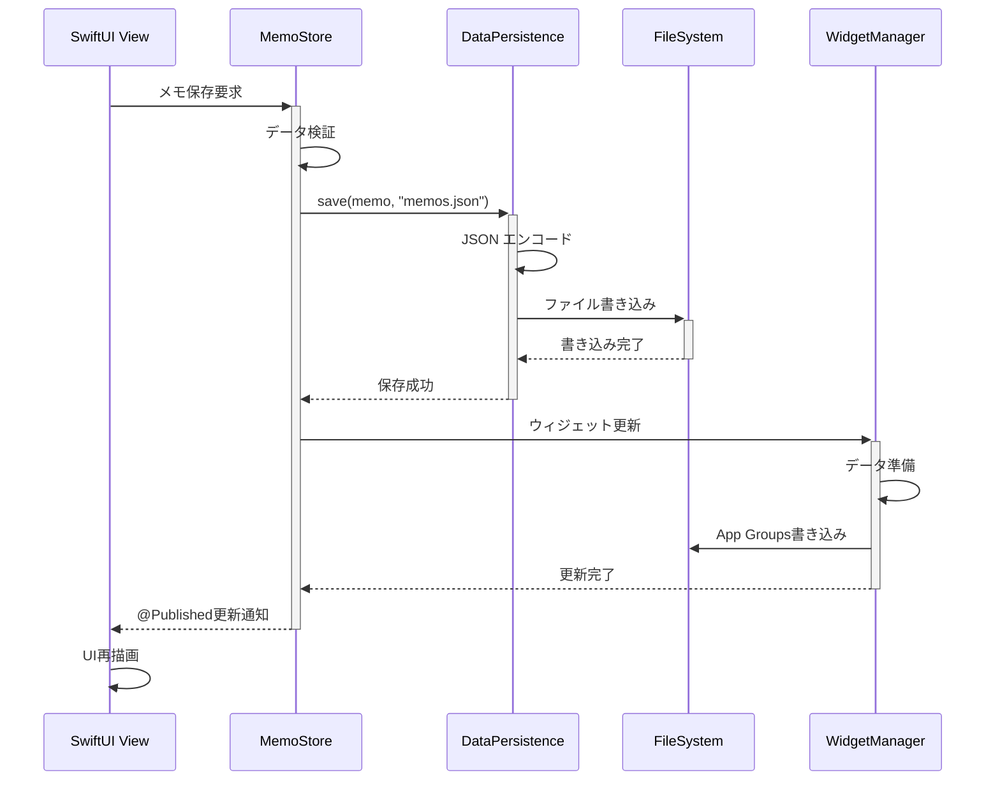
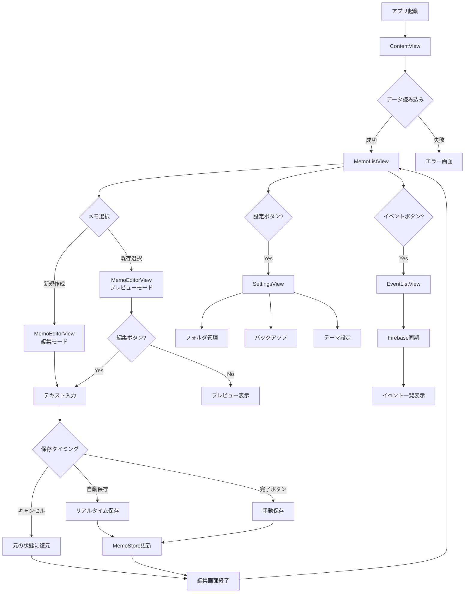
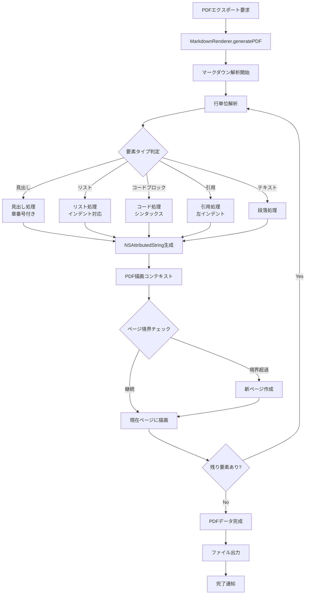
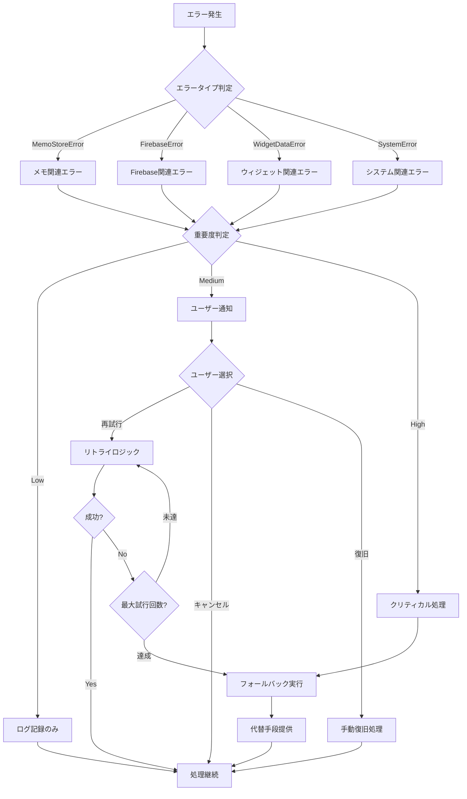
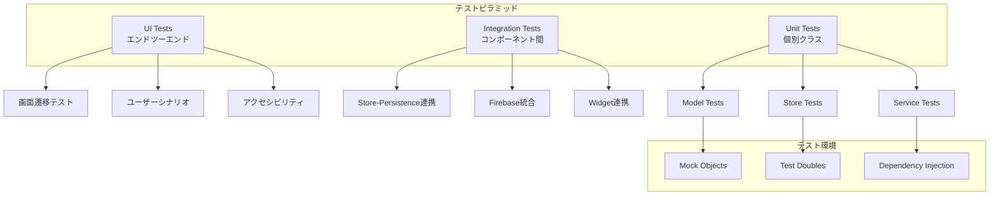

# MemoHero 詳細設計書

**Version 1.0 | 最終更新: 2025年8月29日**

## 概要

### 文書の目的
この詳細設計書は、MemoHeroの実装レベルでの技術仕様を記述する開発者向けドキュメントです。クラス設計、API仕様、データベーススキーマ、アルゴリズム等の実装詳細を包含します。

### 対象読者
- iOS開発者
- システムアーキテクト
- テクニカルリード
- コードレビューアー

## クラス設計

### クラス構成図

```mermaid
classDiagram
    class Memo {
        +UUID id
        +String title
        +String content
        +Date createdAt
        +Date updatedAt
        +UUID? folderId
        +Bool isPinned
        +Date? dueDate
        +TimeInterval totalEditingTime
        +displayTitle: String
        +wordCount: Int
        +characterCount: Int
        +updateContent(String)
        +pin()
        +unpin()
    }
    
    class Folder {
        +UUID id
        +String name
        +Date createdAt
        +Date updatedAt
        +rename(to: String)
        +defaultFolders(): [Folder]
    }
    
    class MemoStore {
        +[Memo] memos
        +Bool isLoading
        +MemoStoreError? error
        +loadMemos()
        +saveMemos()
        +addMemo(Memo)
        +updateMemo(Memo)
        +deleteMemo(Memo)
        +searchMemos(String): [Memo]
    }
    
    class FolderStore {
        +[Folder] folders
        +Bool isLoading
        +FolderStoreError? error
        +loadFolders()
        +saveFolders()
        +addFolder(Folder)
        +updateFolder(Folder)
        +deleteFolder(Folder)
    }
    
    class FirebaseService {
        +[Event] events
        +Bool isConnected
        +Bool isLoading
        +String? fcmToken
        +startListening()
        +stopListening()
        +setupFCM()
        +handleBackgroundMessage()
    }
    
    class ProfileModel {
        +String age
        +String grade
        +String location
        +[String] interests
        +[String] skills
        +String heroType
        +generateTemplate(): String
    }
    
    class NotificationHistoryManager {
        +[FCMNotification] notifications
        +addNotification()
        +clearHistory()
        +handleFCMMessage()
    }
    
    class WidgetDataManager {
        +updateWidgetData()
    }
    
    class DataPersistenceProtocol {
        <<interface>>
        +save(T, String)
        +load(T.Type, String): T
        +delete(String)
        +exists(String): Bool
    }
    
    class LocalDataService {
        +save(T, String)
        +load(T.Type, String): T
        +delete(String)
        +exists(String): Bool
    }
    
    Memo ||--o{ Folder : belongs_to
    MemoStore --> Memo : manages
    FolderStore --> Folder : manages
    MemoStore --> DataPersistenceProtocol : uses
    FolderStore --> DataPersistenceProtocol : uses
    LocalDataService ..|> DataPersistenceProtocol : implements
    WidgetDataManager --> Memo : exports
```

### Model Classes

#### Memo Model
```swift
// MARK: - Memo Model
public struct Memo: Identifiable, Codable, Equatable, Hashable {
    // MARK: - Core Properties
    public let id: UUID
    public var title: String
    public var content: String
    public var createdAt: Date
    public var updatedAt: Date
    
    // MARK: - Organization Properties
    public var folderId: UUID?
    public var isPinned: Bool
    
    // MARK: - Schedule Properties
    public var dueDate: Date?
    public var hasPreNotification: Bool
    public var preNotificationMinutes: Int
    
    // MARK: - Analytics Properties
    public var totalEditingTime: TimeInterval
    
    // MARK: - Initializers
    public init(title: String = \"\", content: String = \"\", folderId: UUID? = nil, dueDate: Date? = nil) {
        self.id = UUID()
        self.title = title
        self.content = content
        self.createdAt = Date()
        self.updatedAt = Date()
        self.folderId = folderId
        self.isPinned = false
        self.dueDate = dueDate
        self.hasPreNotification = true
        self.preNotificationMinutes = 60
        self.totalEditingTime = 0
    }
    
    // MARK: - Computed Properties
    public var displayTitle: String {
        if title.trimmingCharacters(in: .whitespacesAndNewlines).isEmpty {
            let firstLine = content.components(separatedBy: .newlines).first ?? \"\"
            let trimmed = firstLine.trimmingCharacters(in: .whitespacesAndNewlines)
            return trimmed.isEmpty ? \"無題のメモ\" : String(trimmed.prefix(30))
        }
        return title
    }
    
    public var wordCount: Int {
        content.components(separatedBy: .whitespacesAndNewlines)
               .filter { !$0.isEmpty }.count
    }
    
    public var characterCount: Int { content.count }
    public var lineCount: Int { content.components(separatedBy: .newlines).count }
    
    // MARK: - Mutating Methods
    public mutating func updateContent(_ newContent: String) {
        self.content = newContent
        self.updatedAt = Date()
        self.title = extractTitleFromContent(newContent)
    }
    
    public mutating func pin() {
        self.isPinned = true
        self.updatedAt = Date()
    }
    
    public mutating func unpin() {
        self.isPinned = false
        self.updatedAt = Date()
    }
    
    // MARK: - Private Methods
    private func extractTitleFromContent(_ content: String) -> String {
        let lines = content.components(separatedBy: .newlines)
        for line in lines {
            let trimmed = line.trimmingCharacters(in: .whitespacesAndNewlines)
            if !trimmed.isEmpty {
                if trimmed.hasPrefix(\"#\") {
                    return String(trimmed.dropFirst().trimmingCharacters(in: .whitespacesAndNewlines))
                } else {
                    return String(trimmed.prefix(50))
                }
            }
        }
        return \"\"
    }
}
```

#### Folder Model
```swift
// MARK: - Folder Model
public struct Folder: Identifiable, Codable, Hashable, Equatable {
    // MARK: - Properties
    public let id: UUID
    public var name: String
    public let createdAt: Date
    public var updatedAt: Date
    
    // MARK: - Initializer
    public init(name: String, id: UUID = UUID()) {
        self.id = id
        self.name = name
        self.createdAt = Date()
        self.updatedAt = Date()
    }
    
    // MARK: - Static Methods
    public static func defaultFolders() -> [Folder] {
        return [
            Folder(name: \"個人\", id: UUID(uuidString: \"00000000-0000-0000-0000-000000000001\")!),
            Folder(name: \"仕事\", id: UUID(uuidString: \"00000000-0000-0000-0000-000000000002\")!),
            Folder(name: \"アイデア\", id: UUID(uuidString: \"00000000-0000-0000-0000-000000000003\")!)
        ]
    }
    
    // MARK: - Mutating Methods
    public mutating func rename(to newName: String) {
        self.name = newName
        self.updatedAt = Date()
    }
}
```

### Store Classes

#### MemoStore
```swift
// MARK: - MemoStore
@MainActor
final class MemoStore: ObservableObject {
    // MARK: - Published Properties
    @Published var memos: [Memo] = []
    @Published var isLoading: Bool = false
    @Published var isInitialized: Bool = false
    @Published var error: MemoStoreError? = nil
    
    // MARK: - Private Properties
    private let persistence: DataPersistenceProtocol
    private let fileManager = FileManager.default
    private var cancellables = Set<AnyCancellable>()
    private let memosFileName = \"memos.json\"
    
    // MARK: - Initializer
    init(persistence: DataPersistenceProtocol = LocalDataService()) {
        self.persistence = persistence
        setupAutoSave()
    }
    
    // MARK: - Public Methods
    func loadMemos() async {
        isLoading = true
        defer { isLoading = false }
        
        do {
            let loadedMemos = try await persistence.load([Memo].self, from: memosFileName)
            await MainActor.run {
                self.memos = loadedMemos.sorted { $0.updatedAt > $1.updatedAt }
                self.isInitialized = true
                self.error = nil
            }
            Logger.shared.log(\"メモ読み込み成功: \(loadedMemos.count)件\", level: .info)
        } catch {
            await MainActor.run {
                self.error = MemoStoreError.loadFailed(error)
                self.isInitialized = true
            }
            Logger.shared.log(\"メモ読み込み失敗: \(error)\", level: .error)
        }
    }
    
    func saveMemos() async {
        guard isInitialized else { return }
        
        do {
            try await persistence.save(memos, to: memosFileName)
            await MainActor.run {
                self.error = nil
            }
            Logger.shared.log(\"メモ保存成功: \(memos.count)件\", level: .info)
        } catch {
            await MainActor.run {
                self.error = MemoStoreError.saveFailed(error)
            }
            Logger.shared.log(\"メモ保存失敗: \(error)\", level: .error)
        }
    }
    
    func addMemo(_ memo: Memo) {
        memos.insert(memo, at: 0)
        Logger.shared.log(\"メモ追加: \(memo.id.uuidString.prefix(8))\", level: .info)
        Task { await saveMemos() }
    }
    
    func updateMemo(_ updatedMemo: Memo) {
        if let index = memos.firstIndex(where: { $0.id == updatedMemo.id }) {
            memos[index] = updatedMemo
            sortMemos()
            Logger.shared.log(\"メモ更新: \(updatedMemo.id.uuidString.prefix(8))\", level: .info)
            Task { await saveMemos() }
        }
    }
    
    func deleteMemo(_ memo: Memo) {
        memos.removeAll { $0.id == memo.id }
        Logger.shared.log(\"メモ削除: \(memo.id.uuidString.prefix(8))\", level: .info)
        Task { await saveMemos() }
    }
    
    func searchMemos(query: String) -> [Memo] {
        guard !query.isEmpty else { return memos }
        
        return memos.filter { memo in
            memo.title.localizedCaseInsensitiveContains(query) ||
            memo.content.localizedCaseInsensitiveContains(query)
        }
    }
    
    func getMemosByFolder(_ folderId: UUID?) -> [Memo] {
        return memos.filter { $0.folderId == folderId }
    }
    
    func getPinnedMemos() -> [Memo] {
        return memos.filter { $0.isPinned }
    }
    
    // MARK: - Private Methods
    private func setupAutoSave() {
        $memos
            .debounce(for: .milliseconds(500), scheduler: DispatchQueue.main)
            .sink { _ in
                Task { await self.saveMemos() }
            }
            .store(in: &cancellables)
    }
    
    private func sortMemos() {
        memos.sort { memo1, memo2 in
            if memo1.isPinned != memo2.isPinned {
                return memo1.isPinned && !memo2.isPinned
            }
            return memo1.updatedAt > memo2.updatedAt
        }
    }
}
```

#### FolderStore
```swift
// MARK: - FolderStore
@MainActor
final class FolderStore: ObservableObject {
    // MARK: - Published Properties
    @Published var folders: [Folder] = []
    @Published var isLoading: Bool = false
    @Published var error: FolderStoreError? = nil
    
    // MARK: - Private Properties
    private let persistence: DataPersistenceProtocol
    private let foldersFileName = \"folders.json\"
    
    // MARK: - Initializer
    init(persistence: DataPersistenceProtocol = LocalDataService()) {
        self.persistence = persistence
    }
    
    // MARK: - Public Methods
    func loadFolders() async {
        isLoading = true
        defer { isLoading = false }
        
        do {
            let loadedFolders = try await persistence.load([Folder].self, from: foldersFileName)
            await MainActor.run {
                self.folders = loadedFolders
                self.error = nil
            }
        } catch {
            // Initialize with default folders if load fails
            await MainActor.run {
                self.folders = Folder.defaultFolders()
                self.error = nil
            }
            await saveFolders() // Save default folders
        }
    }
    
    func saveFolders() async {
        do {
            try await persistence.save(folders, to: foldersFileName)
            await MainActor.run {
                self.error = nil
            }
        } catch {
            await MainActor.run {
                self.error = FolderStoreError.saveFailed(error)
            }
        }
    }
    
    func addFolder(_ folder: Folder) {
        folders.append(folder)
        Task { await saveFolders() }
    }
    
    func updateFolder(_ updatedFolder: Folder) {
        if let index = folders.firstIndex(where: { $0.id == updatedFolder.id }) {
            folders[index] = updatedFolder
            Task { await saveFolders() }
        }
    }
    
    func deleteFolder(_ folder: Folder) {
        folders.removeAll { $0.id == folder.id }
        Task { await saveFolders() }
    }
    
    func getFolderName(for id: UUID?) -> String {
        guard let id = id,
              let folder = folders.first(where: { $0.id == id }) else {
            return \"すべて\"
        }
        return folder.name
    }
}
```

### Service Classes

#### FirebaseService
```swift
// MARK: - FirebaseService
final class FirebaseService: ObservableObject {
    // MARK: - Singleton
    static let shared = FirebaseService()
    
    // MARK: - Published Properties
    @Published var events: [Event] = []
    @Published var isConnected: Bool = false
    @Published var isLoading: Bool = false
    @Published var error: FirebaseError? = nil
    
    // MARK: - Private Properties
    private let db = Firestore.firestore()
    private var eventsListener: ListenerRegistration?
    
    // MARK: - Initializer
    private init() {
        setupFirestore()
        startListening()
    }
    
    // MARK: - Public Methods
    func startListening() {
        isLoading = true
        
        eventsListener = db.collection(\"events\")
            .order(by: \"date\", descending: true)
            .addSnapshotListener { [weak self] querySnapshot, error in
                guard let self = self else { return }
                
                DispatchQueue.main.async {
                    self.isLoading = false
                    
                    if let error = error {
                        self.error = FirebaseError.listenerFailed(error)
                        self.isConnected = false
                        return
                    }
                    
                    guard let documents = querySnapshot?.documents else {
                        self.events = []
                        return
                    }
                    
                    self.events = documents.compactMap { document in
                        try? document.data(as: Event.self)
                    }
                    self.isConnected = true
                    self.error = nil
                }
            }
    }
    
    func stopListening() {
        eventsListener?.remove()
        eventsListener = nil
        isConnected = false
    }
    
    // MARK: - Private Methods
    private func setupFirestore() {
        let settings = FirestoreSettings()
        settings.cacheSettings = PersistentCacheSettings(sizeBytes: NSNumber(value: FirestoreCacheSizeUnlimited))
        db.settings = settings
    }
    
    deinit {
        stopListening()
    }
}
```

#### WidgetDataManager
```swift
// MARK: - WidgetDataManager
@MainActor
final class WidgetDataManager: ObservableObject {
    // MARK: - Properties
    private let appGroupIdentifier = \"group.com.kondokenji.memoapp\"
    private let widgetDataFileName = \"widget_memos.json\"
    
    // MARK: - Public Methods
    func updateWidgetData() async throws {
        guard let containerURL = FileManager.default.containerURL(forSecurityApplicationGroupIdentifier: appGroupIdentifier) else {
            throw WidgetDataError.appGroupNotFound
        }
        
        let fileURL = containerURL.appendingPathComponent(widgetDataFileName)
        
        // Get recent memos for widget
        let recentMemos = await getRecentMemosForWidget()
        let widgetMemos = recentMemos.map { WidgetMemo(from: $0) }
        
        do {
            let data = try JSONEncoder().encode(widgetMemos)
            try data.write(to: fileURL)
            Logger.shared.log(\"Widget data updated: \(widgetMemos.count) memos\", level: .info)
        } catch {
            Logger.shared.log(\"Widget data update failed: \(error)\", level: .error)
            throw WidgetDataError.updateFailed(error)
        }
    }
    
    // MARK: - Private Methods
    private func getRecentMemosForWidget() async -> [Memo] {
        // Implementation would fetch recent memos from MemoStore
        // This is a simplified version
        return []
    }
}
```

## データ永続化設計

### データフロー図



### JSON Schema

#### Memo JSON Schema
```json
{
  \"$schema\": \"http://json-schema.org/draft-07/schema#\",
  \"type\": \"array\",
  \"items\": {
    \"type\": \"object\",
    \"properties\": {
      \"id\": {
        \"type\": \"string\",
        \"format\": \"uuid\"
      },
      \"title\": {
        \"type\": \"string\",
        \"maxLength\": 200
      },
      \"content\": {
        \"type\": \"string\",
        \"maxLength\": 1048576
      },
      \"createdAt\": {
        \"type\": \"string\",
        \"format\": \"date-time\"
      },
      \"updatedAt\": {
        \"type\": \"string\",
        \"format\": \"date-time\"
      },
      \"folderId\": {
        \"type\": [\"string\", \"null\"],
        \"format\": \"uuid\"
      },
      \"isPinned\": {
        \"type\": \"boolean\"
      },
      \"dueDate\": {
        \"type\": [\"string\", \"null\"],
        \"format\": \"date-time\"
      },
      \"hasPreNotification\": {
        \"type\": \"boolean\"
      },
      \"preNotificationMinutes\": {
        \"type\": \"integer\",
        \"minimum\": 1,
        \"maximum\": 10080
      },
      \"totalEditingTime\": {
        \"type\": \"number\",
        \"minimum\": 0
      }
    },
    \"required\": [\"id\", \"title\", \"content\", \"createdAt\", \"updatedAt\", \"isPinned\", \"hasPreNotification\", \"preNotificationMinutes\", \"totalEditingTime\"]
  }
}
```

### Data Persistence Protocol

```swift
// MARK: - Data Persistence Protocol
protocol DataPersistenceProtocol {
    func save<T: Codable>(_ data: T, to file: String) async throws
    func load<T: Codable>(_ type: T.Type, from file: String) async throws -> T
    func delete(_ file: String) async throws
    func exists(_ file: String) -> Bool
}

// MARK: - Local Data Service
class LocalDataService: DataPersistenceProtocol {
    private let fileManager = FileManager.default
    private let encoder = JSONEncoder()
    private let decoder = JSONDecoder()
    
    init() {
        setupEncoder()
        setupDecoder()
    }
    
    func save<T: Codable>(_ data: T, to file: String) async throws {
        let url = try getDocumentsURL().appendingPathComponent(file)
        let encodedData = try encoder.encode(data)
        try encodedData.write(to: url)
    }
    
    func load<T: Codable>(_ type: T.Type, from file: String) async throws -> T {
        let url = try getDocumentsURL().appendingPathComponent(file)
        let data = try Data(contentsOf: url)
        return try decoder.decode(type, from: data)
    }
    
    func delete(_ file: String) async throws {
        let url = try getDocumentsURL().appendingPathComponent(file)
        try fileManager.removeItem(at: url)
    }
    
    func exists(_ file: String) -> Bool {
        guard let url = try? getDocumentsURL().appendingPathComponent(file) else { return false }
        return fileManager.fileExists(atPath: url.path)
    }
    
    // MARK: - Private Methods
    private func setupEncoder() {
        encoder.dateEncodingStrategy = .iso8601
        encoder.outputFormatting = [.prettyPrinted, .sortedKeys]
    }
    
    private func setupDecoder() {
        decoder.dateDecodingStrategy = .iso8601
    }
    
    private func getDocumentsURL() throws -> URL {
        return try fileManager.url(for: .documentDirectory,
                                  in: .userDomainMask,
                                  appropriateFor: nil,
                                  create: false)
    }
}
```

## UI コンポーネント設計

### 画面構成フロー



### Custom Text Editor

#### HighlightableTextEditor
```swift
// MARK: - HighlightableTextEditor
struct HighlightableTextEditor: UIViewRepresentable {
    // MARK: - Properties
    @Binding var text: String
    @Binding var selectedRange: NSRange?
    var searchResults: [NSRange]
    var currentSearchIndex: Int
    var onTextChange: ((String) -> Void)?
    var onSelectionChange: ((NSRange) -> Void)?
    
    // MARK: - UIViewRepresentable
    func makeUIView(context: Context) -> UITextView {
        let textView = UITextView()
        textView.delegate = context.coordinator
        textView.font = UIFont.systemFont(ofSize: 16)
        textView.isScrollEnabled = true
        textView.isEditable = true
        textView.isUserInteractionEnabled = true
        textView.backgroundColor = UIColor.systemBackground
        textView.textColor = UIColor.label
        return textView
    }
    
    func updateUIView(_ uiView: UITextView, context: Context) {
        // Update text if different
        if uiView.text != text {
            let selectedRange = uiView.selectedRange
            uiView.text = text
            uiView.selectedRange = selectedRange
        }
        
        // Apply search highlighting
        highlightSearchResults(in: uiView)
        
        // Update selection if needed
        if let range = selectedRange, range != uiView.selectedRange {
            uiView.selectedRange = range
        }
    }
    
    func makeCoordinator() -> Coordinator {
        Coordinator(self)
    }
    
    // MARK: - Coordinator
    class Coordinator: NSObject, UITextViewDelegate {
        var parent: HighlightableTextEditor
        
        init(_ parent: HighlightableTextEditor) {
            self.parent = parent
        }
        
        func textViewDidChange(_ textView: UITextView) {
            DispatchQueue.main.async {
                self.parent.text = textView.text
                self.parent.onTextChange?(textView.text)
            }
        }
        
        func textViewDidChangeSelection(_ textView: UITextView) {
            DispatchQueue.main.async {
                self.parent.selectedRange = textView.selectedRange
                self.parent.onSelectionChange?(textView.selectedRange)
            }
        }
    }
    
    // MARK: - Private Methods
    private func highlightSearchResults(in textView: UITextView) {
        let attributedString = NSMutableAttributedString(string: text)
        let range = NSRange(location: 0, length: text.count)
        
        // Reset attributes
        attributedString.addAttributes([
            .foregroundColor: UIColor.label,
            .backgroundColor: UIColor.clear,
            .font: UIFont.systemFont(ofSize: 16)
        ], range: range)
        
        // Highlight search results
        for (index, searchRange) in searchResults.enumerated() {
            let backgroundColor = index == currentSearchIndex ? UIColor.systemOrange : UIColor.systemYellow
            attributedString.addAttribute(.backgroundColor, value: backgroundColor, range: searchRange)
        }
        
        textView.attributedText = attributedString
    }
}
```

### Markdown Renderer

#### PDF Generation Engine


```swift
// MARK: - PDF Generation
class MarkdownRenderer {
    // MARK: - Properties
    private static let pageMargins = CGRect(x: 20, y: 25, width: 555, height: 792)
    private static let a4PageSize = CGSize(width: 595, height: 842)
    
    // MARK: - Public Methods
    static func generatePDF(from memo: Memo, enableChapterNumbering: Bool = true, completion: @escaping (Data?) -> Void) {
        DispatchQueue.global(qos: .userInitiated).async {
            let pdfData = createPDFData(from: memo, enableChapterNumbering: enableChapterNumbering)
            DispatchQueue.main.async {
                completion(pdfData)
            }
        }
    }
    
    // MARK: - Private Methods
    private static func createPDFData(from memo: Memo, enableChapterNumbering: Bool) -> Data? {
        let format = UIGraphicsPDFRendererFormat()
        format.documentInfo = [
            kCGPDFContextTitle as String: memo.displayTitle,
            kCGPDFContextAuthor as String: \"MemoHero\",
            kCGPDFContextCreator as String: \"MemoHero v2.1\",
            kCGPDFContextSubject as String: \"Markdown Document\"
        ]
        
        let renderer = UIGraphicsPDFRenderer(bounds: CGRect(origin: .zero, size: a4PageSize), format: format)
        
        return renderer.pdfData { context in
            let attributedStrings = parseMarkdownForPDF(memo.content, enableChapterNumbering: enableChapterNumbering)
            renderAttributedStrings(attributedStrings, in: context)
        }
    }
    
    private static func parseMarkdownForPDF(_ text: String, enableChapterNumbering: Bool) -> [NSAttributedString] {
        var elements: [NSAttributedString] = []
        let lines = text.components(separatedBy: .newlines)
        var currentChapterCounters = (h2: 0, h3: 0, h4: 0, h5: 0, h6: 0)
        
        var inCodeBlock = false
        var codeBlockContent = \"\"
        var codeBlockLanguage = \"\"
        
        for (index, line) in lines.enumerated() {
            let trimmedLine = line.trimmingCharacters(in: .whitespacesAndNewlines)
            
            // Handle code blocks
            if trimmedLine.hasPrefix(\"```\") {
                if inCodeBlock {
                    // End of code block
                    let codeAttributedString = createCodeBlockAttributedString(codeBlockContent, language: codeBlockLanguage)
                    elements.append(codeAttributedString)
                    inCodeBlock = false
                    codeBlockContent = \"\"
                    codeBlockLanguage = \"\"
                } else {
                    // Start of code block
                    inCodeBlock = true
                    codeBlockLanguage = String(trimmedLine.dropFirst(3))
                }
                continue
            }
            
            if inCodeBlock {
                codeBlockContent += line + \"\\n\"
                continue
            }
            
            // Parse regular markdown
            let attributedString = parseLineForPDF(line, 
                                                 lines: lines, 
                                                 lineIndex: index, 
                                                 enableChapterNumbering: enableChapterNumbering,
                                                 chapterCounters: &currentChapterCounters)
            
            if attributedString.length > 0 {
                elements.append(attributedString)
            }
        }
        
        return elements
    }
    
    private static func parseLineForPDF(_ line: String, 
                                      lines: [String], 
                                      lineIndex: Int, 
                                      enableChapterNumbering: Bool,
                                      chapterCounters: inout (h2: Int, h3: Int, h4: Int, h5: Int, h6: Int)) -> NSAttributedString {
        
        let trimmedLine = line.trimmingCharacters(in: .whitespacesAndNewlines)
        
        if trimmedLine.isEmpty {
            return NSAttributedString(string: \"\\n\", attributes: [.font: UIFont.systemFont(ofSize: 12)])
        }
        
        // Handle headings
        if let headingLevel = getHeadingLevel(trimmedLine) {
            return createHeadingAttributedString(trimmedLine, 
                                               level: headingLevel, 
                                               enableChapterNumbering: enableChapterNumbering,
                                               chapterCounters: &chapterCounters)
        }
        
        // Handle lists
        if isListItem(trimmedLine) {
            return createListItemAttributedString(trimmedLine)
        }
        
        // Handle quotes
        if trimmedLine.hasPrefix(\">\") {
            return createQuoteAttributedString(trimmedLine)
        }
        
        // Regular paragraph
        return createParagraphAttributedString(trimmedLine)
    }
    
    private static func createHeadingAttributedString(_ line: String, 
                                                    level: Int, 
                                                    enableChapterNumbering: Bool,
                                                    chapterCounters: inout (h2: Int, h3: Int, h4: Int, h5: Int, h6: Int)) -> NSAttributedString {
        
        let content = String(line.dropFirst(level + 1))
        var displayText = content
        
        if enableChapterNumbering && level >= 2 {
            // Update counters
            switch level {
            case 2:
                chapterCounters.h2 += 1
                chapterCounters.h3 = 0
                chapterCounters.h4 = 0
                chapterCounters.h5 = 0
                chapterCounters.h6 = 0
                displayText = \"\\(chapterCounters.h2). \\(content)\"
            case 3:
                chapterCounters.h3 += 1
                chapterCounters.h4 = 0
                chapterCounters.h5 = 0
                chapterCounters.h6 = 0
                displayText = \"\\(chapterCounters.h2).\\(chapterCounters.h3). \\(content)\"
            default:
                break
            }
        }
        
        let fontSize: CGFloat = level == 1 ? 18 : (level == 2 ? 16 : 14)
        let font = UIFont.boldSystemFont(ofSize: fontSize)
        
        let attributes: [NSAttributedString.Key: Any] = [
            .font: font,
            .foregroundColor: UIColor.black
        ]
        
        let attributedString = NSMutableAttributedString(string: displayText + \"\\n\", attributes: attributes)
        
        // Add border for h2 and h3
        if level <= 3 {
            let paragraphStyle = NSMutableParagraphStyle()
            paragraphStyle.paragraphSpacing = 8
            paragraphStyle.paragraphSpacingBefore = 8
            attributedString.addAttribute(.paragraphStyle, value: paragraphStyle, range: NSRange(location: 0, length: attributedString.length))
        }
        
        return attributedString
    }
    
    private static func createCodeBlockAttributedString(_ content: String, language: String) -> NSAttributedString {
        let font = UIFont.monospacedSystemFont(ofSize: 11, weight: .regular)
        let attributes: [NSAttributedString.Key: Any] = [
            .font: font,
            .foregroundColor: UIColor.darkGray,
            .backgroundColor: UIColor.systemGray6
        ]
        
        let attributedString = NSMutableAttributedString(string: content + \"\\n\", attributes: attributes)
        
        let paragraphStyle = NSMutableParagraphStyle()
        paragraphStyle.paragraphSpacing = 4
        paragraphStyle.firstLineHeadIndent = 8
        paragraphStyle.headIndent = 8
        attributedString.addAttribute(.paragraphStyle, value: paragraphStyle, range: NSRange(location: 0, length: attributedString.length))
        
        return attributedString
    }
    
    private static func renderAttributedStrings(_ attributedStrings: [NSAttributedString], in context: UIGraphicsPDFRendererContext) {
        var currentY: CGFloat = pageMargins.minY
        var pageNumber = 1
        
        context.beginPage()
        
        for attributedString in attributedStrings {
            let textRect = CGRect(x: pageMargins.minX, 
                                y: currentY, 
                                width: pageMargins.width, 
                                height: pageMargins.maxY - currentY)
            
            let framesetter = CTFramesetterCreateWithAttributedString(attributedString)
            let suggestedSize = CTFramesetterSuggestFrameSizeWithConstraints(framesetter, 
                                                                           CFRange(location: 0, length: 0), 
                                                                           nil, 
                                                                           CGSize(width: pageMargins.width, height: .greatestFiniteMagnitude), 
                                                                           nil)
            
            // Check if we need a new page
            if currentY + suggestedSize.height > pageMargins.maxY {
                pageNumber += 1
                context.beginPage()
                currentY = pageMargins.minY
            }
            
            let drawRect = CGRect(x: pageMargins.minX, 
                                y: currentY, 
                                width: pageMargins.width, 
                                height: min(suggestedSize.height, pageMargins.maxY - currentY))
            
            attributedString.draw(in: drawRect)
            currentY += suggestedSize.height + 2
        }
    }
    
    // MARK: - Helper Methods
    private static func getHeadingLevel(_ line: String) -> Int? {
        let prefixes = [\"# \", \"## \", \"### \", \"#### \", \"##### \", \"###### \"]
        for (index, prefix) in prefixes.enumerated() {
            if line.hasPrefix(prefix) {
                return index + 1
            }
        }
        return nil
    }
    
    private static func isListItem(_ line: String) -> Bool {
        return line.hasPrefix(\"- \") || 
               line.hasPrefix(\"* \") || 
               line.hasPrefix(\"+ \") ||
               line.range(of: \"^\\\\d+\\\\. \", options: .regularExpression) != nil
    }
    
    private static func createListItemAttributedString(_ line: String) -> NSAttributedString {
        let font = UIFont.systemFont(ofSize: 12)
        let attributes: [NSAttributedString.Key: Any] = [
            .font: font,
            .foregroundColor: UIColor.black
        ]
        
        let attributedString = NSMutableAttributedString(string: line + \"\\n\", attributes: attributes)
        
        let paragraphStyle = NSMutableParagraphStyle()
        paragraphStyle.firstLineHeadIndent = 0
        paragraphStyle.headIndent = 20
        paragraphStyle.paragraphSpacing = 1
        attributedString.addAttribute(.paragraphStyle, value: paragraphStyle, range: NSRange(location: 0, length: attributedString.length))
        
        return attributedString
    }
    
    private static func createQuoteAttributedString(_ line: String) -> NSAttributedString {
        let content = String(line.dropFirst(1).trimmingCharacters(in: .whitespaces))
        let font = UIFont.systemFont(ofSize: 12)
        let attributes: [NSAttributedString.Key: Any] = [
            .font: font,
            .foregroundColor: UIColor.darkGray
        ]
        
        let attributedString = NSMutableAttributedString(string: content + \"\\n\", attributes: attributes)
        
        let paragraphStyle = NSMutableParagraphStyle()
        paragraphStyle.firstLineHeadIndent = 16
        paragraphStyle.headIndent = 16
        paragraphStyle.paragraphSpacing = 2
        attributedString.addAttribute(.paragraphStyle, value: paragraphStyle, range: NSRange(location: 0, length: attributedString.length))
        
        return attributedString
    }
    
    private static func createParagraphAttributedString(_ line: String) -> NSAttributedString {
        let font = UIFont.systemFont(ofSize: 12)
        let attributes: [NSAttributedString.Key: Any] = [
            .font: font,
            .foregroundColor: UIColor.black
        ]
        
        let attributedString = NSMutableAttributedString(string: line + \"\\n\", attributes: attributes)
        
        let paragraphStyle = NSMutableParagraphStyle()
        paragraphStyle.paragraphSpacing = 1
        attributedString.addAttribute(.paragraphStyle, value: paragraphStyle, range: NSRange(location: 0, length: attributedString.length))
        
        return attributedString
    }
}
```

## エラーハンドリング実装

### エラー分類・処理フロー



### Error Types

```swift
// MARK: - MemoStore Errors
enum MemoStoreError: Error, LocalizedError, Identifiable {
    case loadFailed(Error)
    case saveFailed(Error)
    case deleteFailed(Error)
    case dataCorruption(String)
    case diskSpaceFull
    case permissionDenied
    
    var id: String {
        switch self {
        case .loadFailed: return \"loadFailed\"
        case .saveFailed: return \"saveFailed\"
        case .deleteFailed: return \"deleteFailed\"
        case .dataCorruption: return \"dataCorruption\"
        case .diskSpaceFull: return \"diskSpaceFull\"
        case .permissionDenied: return \"permissionDenied\"
        }
    }
    
    var errorDescription: String? {
        switch self {
        case .loadFailed(let error):
            return \"メモの読み込みに失敗しました: \\(error.localizedDescription)\"
        case .saveFailed(let error):
            return \"メモの保存に失敗しました: \\(error.localizedDescription)\"
        case .deleteFailed(let error):
            return \"メモの削除に失敗しました: \\(error.localizedDescription)\"
        case .dataCorruption(let message):
            return \"データが破損しています: \\(message)\"
        case .diskSpaceFull:
            return \"ディスク容量が不足しています\"
        case .permissionDenied:
            return \"ファイルへのアクセスが拒否されました\"
        }
    }
    
    var recoveryStrategy: RecoveryStrategy {
        switch self {
        case .loadFailed, .saveFailed: return .retry
        case .deleteFailed: return .userInput
        case .dataCorruption: return .fallback
        case .diskSpaceFull: return .userInput
        case .permissionDenied: return .restart
        }
    }
    
    var severity: ErrorSeverity {
        switch self {
        case .loadFailed, .saveFailed, .deleteFailed: return .medium
        case .dataCorruption, .diskSpaceFull, .permissionDenied: return .high
        }
    }
}

// MARK: - Firebase Errors
enum FirebaseError: Error, LocalizedError, Identifiable {
    case configurationFailed(Error)
    case connectionFailed(Error)
    case listenerFailed(Error)
    case dataParsingFailed(String)
    case networkUnavailable
    
    var id: String {
        switch self {
        case .configurationFailed: return \"configurationFailed\"
        case .connectionFailed: return \"connectionFailed\"
        case .listenerFailed: return \"listenerFailed\"
        case .dataParsingFailed: return \"dataParsingFailed\"
        case .networkUnavailable: return \"networkUnavailable\"
        }
    }
    
    var errorDescription: String? {
        switch self {
        case .configurationFailed(let error):
            return \"Firebase設定に失敗しました: \\(error.localizedDescription)\"
        case .connectionFailed(let error):
            return \"Firebase接続に失敗しました: \\(error.localizedDescription)\"
        case .listenerFailed(let error):
            return \"データの監視に失敗しました: \\(error.localizedDescription)\"
        case .dataParsingFailed(let message):
            return \"データの解析に失敗しました: \\(message)\"
        case .networkUnavailable:
            return \"ネットワークに接続できません\"
        }
    }
}

// MARK: - Widget Data Errors
enum WidgetDataError: Error, LocalizedError {
    case appGroupNotFound
    case updateFailed(Error)
    case encodingFailed(Error)
    
    var errorDescription: String? {
        switch self {
        case .appGroupNotFound:
            return \"アプリグループが見つかりません\"
        case .updateFailed(let error):
            return \"ウィジェットデータの更新に失敗しました: \\(error.localizedDescription)\"
        case .encodingFailed(let error):
            return \"データのエンコードに失敗しました: \\(error.localizedDescription)\"
        }
    }
}
```

### Error Recovery

```swift
// MARK: - Error Recovery Manager
@MainActor
class ErrorRecoveryManager: ObservableObject {
    @Published var currentError: AppError?
    @Published var isRecovering: Bool = false
    
    private let maxRetryCount = 3
    private var retryCount = 0
    
    func handleError(_ error: AppError) {
        currentError = error
        
        switch error.recoveryStrategy {
        case .retry:
            attemptRetry()
        case .fallback:
            performFallback()
        case .userInput:
            requestUserInput()
        case .restart:
            requestAppRestart()
        }
    }
    
    private func attemptRetry() {
        guard retryCount < maxRetryCount else {
            performFallback()
            return
        }
        
        isRecovering = true
        retryCount += 1
        
        DispatchQueue.main.asyncAfter(deadline: .now() + 1.0) {
            // Retry the failed operation
            self.isRecovering = false
        }
    }
    
    private func performFallback() {
        // Implement fallback logic
        currentError = nil
        retryCount = 0
    }
    
    private func requestUserInput() {
        // Show user input dialog
    }
    
    private func requestAppRestart() {
        // Show app restart recommendation
    }
}
```

## テスト実装

### テスト戦略図



### Unit Tests

#### Model Tests
```swift
// MARK: - Memo Model Tests
class MemoTests: XCTestCase {
    
    func testMemoInitialization() {
        // Given
        let title = \"Test Memo\"
        let content = \"This is a test memo content\"
        
        // When
        let memo = Memo(title: title, content: content)
        
        // Then
        XCTAssertEqual(memo.title, title)
        XCTAssertEqual(memo.content, content)
        XCTAssertFalse(memo.isPinned)
        XCTAssertNil(memo.folderId)
        XCTAssertEqual(memo.totalEditingTime, 0)
    }
    
    func testMemoDisplayTitle() {
        // Given - Memo with empty title
        var memo = Memo(title: \"\", content: \"# Heading\\nContent\")
        
        // When
        let displayTitle = memo.displayTitle
        
        // Then
        XCTAssertEqual(displayTitle, \"Heading\")
        
        // Given - Memo with title
        memo.title = \"Custom Title\"
        
        // When
        let displayTitle2 = memo.displayTitle
        
        // Then
        XCTAssertEqual(displayTitle2, \"Custom Title\")
    }
    
    func testMemoWordCount() {
        // Given
        let memo = Memo(title: \"Title\", content: \"Hello world this is a test\")
        
        // When
        let wordCount = memo.wordCount
        
        // Then
        XCTAssertEqual(wordCount, 6)
    }
    
    func testMemoPin() {
        // Given
        var memo = Memo()
        
        // When
        memo.pin()
        
        // Then
        XCTAssertTrue(memo.isPinned)
    }
    
    func testMemoUnpin() {
        // Given
        var memo = Memo()
        memo.pin()
        
        // When
        memo.unpin()
        
        // Then
        XCTAssertFalse(memo.isPinned)
    }
}
```

#### Store Tests
```swift
// MARK: - MemoStore Tests
class MemoStoreTests: XCTestCase {
    var sut: MemoStore!
    var mockPersistence: MockDataPersistence!
    
    override func setUp() {
        super.setUp()
        mockPersistence = MockDataPersistence()
        sut = MemoStore(persistence: mockPersistence)
    }
    
    override func tearDown() {
        sut = nil
        mockPersistence = nil
        super.tearDown()
    }
    
    func testAddMemo() async {
        // Given
        let memo = Memo(title: \"Test\", content: \"Content\")
        mockPersistence.saveResult = .success(())
        
        // When
        await sut.addMemo(memo)
        
        // Then
        XCTAssertTrue(sut.memos.contains(memo))
        XCTAssertTrue(mockPersistence.saveWasCalled)
    }
    
    func testUpdateMemo() async {
        // Given
        let originalMemo = Memo(title: \"Original\", content: \"Content\")
        await sut.addMemo(originalMemo)
        
        var updatedMemo = originalMemo
        updatedMemo.title = \"Updated\"
        mockPersistence.saveResult = .success(())
        
        // When
        await sut.updateMemo(updatedMemo)
        
        // Then
        XCTAssertEqual(sut.memos.first?.title, \"Updated\")
        XCTAssertTrue(mockPersistence.saveWasCalled)
    }
    
    func testDeleteMemo() async {
        // Given
        let memo = Memo(title: \"Test\", content: \"Content\")
        await sut.addMemo(memo)
        mockPersistence.saveResult = .success(())
        
        // When
        await sut.deleteMemo(memo)
        
        // Then
        XCTAssertFalse(sut.memos.contains(memo))
        XCTAssertTrue(mockPersistence.saveWasCalled)
    }
    
    func testSearchMemos() async {
        // Given
        let memo1 = Memo(title: \"First\", content: \"Content\")
        let memo2 = Memo(title: \"Second\", content: \"Different\")
        await sut.addMemo(memo1)
        await sut.addMemo(memo2)
        
        // When
        let results = await sut.searchMemos(query: \"First\")
        
        // Then
        XCTAssertEqual(results.count, 1)
        XCTAssertEqual(results.first?.title, \"First\")
    }
}

// MARK: - Mock Data Persistence
class MockDataPersistence: DataPersistenceProtocol {
    var saveWasCalled = false
    var loadWasCalled = false
    var deleteWasCalled = false
    
    var saveResult: Result<Void, Error> = .success(())
    var loadResult: Result<Any, Error> = .success([])
    var deleteResult: Result<Void, Error> = .success(())
    
    func save<T: Codable>(_ data: T, to file: String) async throws {
        saveWasCalled = true
        try saveResult.get()
    }
    
    func load<T: Codable>(_ type: T.Type, from file: String) async throws -> T {
        loadWasCalled = true
        let result = try loadResult.get()
        return result as! T
    }
    
    func delete(_ file: String) async throws {
        deleteWasCalled = true
        try deleteResult.get()
    }
    
    func exists(_ file: String) -> Bool {
        return true
    }
}
```

### Integration Tests

```swift
// MARK: - Integration Tests
class MemoHeroIntegrationTests: XCTestCase {
    
    func testMemoCreationToStorage() async throws {
        // Given
        let persistence = LocalDataService()
        let store = MemoStore(persistence: persistence)
        let memo = Memo(title: \"Integration Test\", content: \"Test content\")
        
        // When
        await store.addMemo(memo)
        await store.saveMemos()
        
        // Create new store instance to verify persistence
        let newStore = MemoStore(persistence: persistence)
        await newStore.loadMemos()
        
        // Then
        XCTAssertTrue(newStore.memos.contains(where: { $0.title == \"Integration Test\" }))
    }
    
    func testWidgetDataUpdate() async throws {
        // Given
        let widgetManager = WidgetDataManager()
        let memo = Memo(title: \"Widget Test\", content: \"Content\")
        
        // When
        try await widgetManager.updateWidgetData()
        
        // Then
        // Verify widget data file exists and contains expected data
        let appGroupURL = FileManager.default.containerURL(forSecurityApplicationGroupIdentifier: \"group.com.kondokenji.memoapp\")!
        let widgetDataURL = appGroupURL.appendingPathComponent(\"widget_memos.json\")
        XCTAssertTrue(FileManager.default.fileExists(atPath: widgetDataURL.path))
    }
}
```

### UI Tests

```swift
// MARK: - UI Tests
class MemoHeroUITests: XCTestCase {
    
    override func setUpWithError() throws {
        continueAfterFailure = false
    }
    
    func testMemoCreationFlow() throws {
        // Given
        let app = XCUIApplication()
        app.launch()
        
        // When
        let addButton = app.buttons[\"add_memo_button\"]
        addButton.tap()
        
        let textView = app.textViews[\"memo_content_editor\"]
        textView.tap()
        textView.typeText(\"# Test Memo\\nThis is a test memo content\")
        
        let saveButton = app.buttons[\"save_memo_button\"]
        saveButton.tap()
        
        // Then
        let memoCell = app.cells.containing(.staticText, identifier: \"Test Memo\").element
        XCTAssertTrue(memoCell.exists)
    }
    
    func testSearchFunctionality() throws {
        // Given
        let app = XCUIApplication()
        app.launch()
        
        // When
        let searchField = app.searchFields[\"search_memos\"]
        searchField.tap()
        searchField.typeText(\"test\")
        
        // Then
        let searchResults = app.tables[\"memo_list\"].cells
        XCTAssertGreaterThan(searchResults.count, 0)
    }
    
    func testFolderNavigation() throws {
        // Given
        let app = XCUIApplication()
        app.launch()
        
        // When
        let settingsButton = app.buttons[\"settings_button\"]
        settingsButton.tap()
        
        let folderManagementButton = app.buttons[\"folder_management_button\"]
        folderManagementButton.tap()
        
        // Then
        let folderList = app.tables[\"folder_list\"]
        XCTAssertTrue(folderList.exists)
    }
}
```


## 改訂履歴

| Version | 日付 | 変更内容 | 担当者 |
|---------|------|----------|--------|
| 1.0 | 2025-08-29 | 初版作成 | kondokenji |

**MemoHero 詳細設計書 v1.0**  
© 2025 kondokenji. All rights reserved.